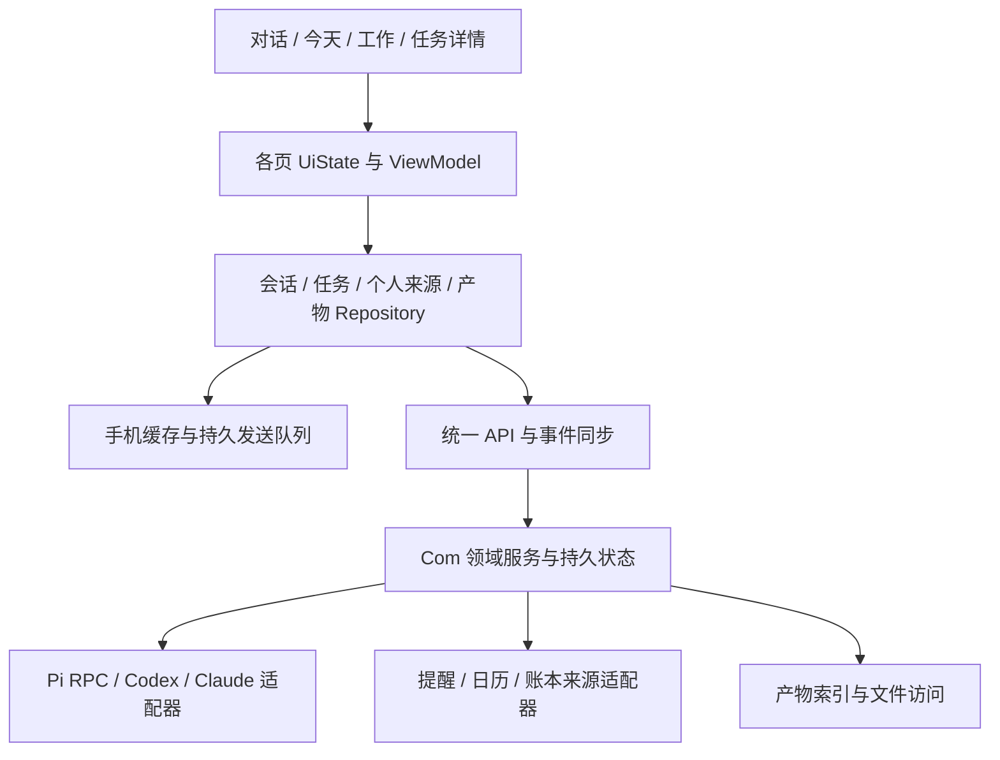

<!-- Hallmark · pre-emit critique: P5 H4 E4 S5 R5 V4 -->
# Com! 1.8.2 优化审查与建议

2026-10-03 · 本文是建议，不代表这些改动已经实现。

**核心判断：当前最有价值的投入，是让手机上的交办、跟进、找回和取用成果形成可靠闭环。保留 Kotlin/Compose + FastAPI/SQLite + Pi 主线，在现有系统里收敛状态、补齐成果访问与历史检索，再优化各页的信息层级。**

## 1. 本次核验范围

| 项目 | 当前证据 |
|---|---|
| 实体手机 | ADB 读取 Xiaomi 2608BPX34C：work.eddie.sessions，1.8.2 / versionCode 20，最后更新 2026-10-03 22:06:47 |
| 本机源码 | MBP，HEAD 47274e3；android/app/build.gradle 为 1.8.2 / 20；审查前仅有未跟踪 _archive/ |
| 在线服务 | 实时 GET 公网 /sessions/health 成功：后端 1.8.1，Pi 主线，主线与 worker full-access，目标调度关闭 |
| 布局证据 | 亲自查看 1.8.2 保存的实机主页与窄屏截图，1.8.1 保存的今天、工作、更多、长任务截图；1.8.2 只修改主页阅读空间 |
| 代码 | 核对导航、主对话、今天、工作、任务详情、产物卡、状态管理、主对话快照与 SSE |
| 限制 | 本次未发送生产消息、操作账本或提醒，未重跑完整真机交互；保存的截图不是本次新抓取，模拟器截图含测试数据 |

1.8.2 前端与 1.8.1 后端是本轮发布的预期组合，不因版本号不同直接判为兼容问题。既有测试数字见原交付报告，本次不将其说成重新验证结果。

## 2. 应保留的产品方向

- 三个底部入口：对话、今天、工作。任务台账继续作为二级入口，通过今天和消息卡进入。
- 白／浅灰背景、克制的线性图标、用户与助手消息的区分，以及角色形象。
- Pi 是持续主线，可直接办事，也可按实际需要委派；Claude/Codex 工作会话保留直接进入的路径。
- 普通聊天不自动变成后台任务；同一事项补充、新事项、提醒、执行任务分别有明确语义。
- 保留现有 request_id、outbox、来源绑定、执行与验收分离、unknown 不重放等基础能力。

当前已经实现的 SSE、持久任务、内联任务卡、提醒动作、原文定位和三级状态不能再次列为“从零新增”。后续主要做可靠性与可发现性的增量。

## 3. 当前问题与收益排序

这里的 P0 指下一轮优先处理的可信度／可用性问题，不代表已发生生产事故。

| 优先级 | 观察与依据 | 建议 | 可检查的结果 |
|---|---|---|---|
| P0 | 今天页头不校验 fresh 就显示待决定／在执行数量；卡片却提示缓存 | 区分未读取、缓存、已同步空结果、局部失败；数字附更新时间 | 断网首次进入不显示“确定为 0”；已有缓存显示缓存数与时间 |
| P0 | 1.8.2 实机存档中头像覆盖正文；透明区测试只证明能透出 | 阅读时让头像收起或退出正文区域，暂停滚动／回到底部再恢复 | 长文任意位置都可完整阅读，保留透明顶部偏好 |
| P0 | 产物卡只对 HTTP(S) 提供打开／分享；远端路径仅复制 | 增加受鉴权的产物资源接口与手机预览／下载 | mini 生成 PDF、图片或文档后，手机能直接取用 |
| P0/P1 | Store.kt 兼管网络、缓存、录音、导航、聊天与多个业务状态 | 先统一状态语义，再按领域拆分，逐条路径迁移 | 今天、消息卡、任务详情对同一事项呈现一致 |
| P1 | 主对话 snapshot 查询 LIMIT 500；本次检查的主线接口未提供历史分页／搜索 | 加游标分页、主对话搜索、日期定位与搜索结果回原消息 | 501 条以前的消息能找回；滚动加载不跳位置 |
| P1 | 工作页外层固定标题，内层仍有 Com! 标题和菜单 | 合并顶栏，突出最近项目／会话与继续工作 | 从工作页继续上次事项不必先绕进多个历史入口 |
| P1 | 同一屏大量“回复结束”、时间、状态与卡片 | 正常完成状态默认收起；异常与待决策状态保留 | 一屏正文增加，同时没有隐藏实际待办 |
| P1 | 活跃工作会话循环约 800ms 加请求耗时；每五 tick 刷列表／详情 | 按页面与活跃状态订阅，统一刷新协调器，断线退避 | 空闲请求下降，工作状态延迟没有显著变差 |
| P1 | 主对话、今天大屏仍以宽单列为主 | 内容足够时用列表－详情双栏，底部导航不变 | 展开时能边看任务边看结果，收起保留选中项 |
| P2 | 记忆分层、技能晋升、凭据保管仍有提案；承诺追踪未实现 | 按明确用例逐项验证，避免一次扩展全部系统 | 每项能力有来源、失效与撤销路径，并能实际复用 |

## 4. 架构：以模块边界替代继续堆叠全局状态

### 4.1 保持现有部署形态

对个人使用规模，当前原生 Android、FastAPI、SQLite 与 mini 执行器足以继续发展。本次证据不支持为了“架构升级”改成微服务、换数据库或重写前端。最先要解决的是职责混杂和协议表达，而非技术栈。

建议边界如下，模块名是目标结构，不要求一次创建全部目录或 Gradle 模块：

### 4.2 手机状态按领域拆分

Store.kt 当前 961 行，WorkbenchModel 同时管理多个页面的 JSONObject、fresh 布尔值、语音和导航。行数本身不是缺陷；跨页面共享原始 JSON 与许多独立布尔值，使状态组合和失败恢复难以统一。

优先提取三类对象：

1. `ConversationRepository`：消息、引用、草稿、outbox、流式同步；先稳定，避免动发送语义。
2. `TaskRepository`：任务、补充、验收、产物、来源跳转。
3. `PersonalSourcesRepository`：日历、提醒、账本、主动观察；各来源独立成功／失败。

网络边界将 JSON 转成类型化对象，UI 使用不可变 UiState；错误区分可重试读取、输入无效、送达未知和执行失败。不要只把旧文件切小后继续共享所有可变字段。

本地持久层按数据性质选择：复杂消息／任务投影与查询可逐步用 Room；少量设置用 DataStore；既有加密缓存不能迁成无保护的普通数据库。优先迁读取与投影，保留现有 request_id 和队列回执，旧格式读兼容验证后再退役。

### 4.3 数据新鲜度必须按来源表达

`TodayDecisionCard` 的 fresh 当前是 workProposals、hermes、signals、taskLedger 四项的合取。这会让不参与某项决策的数据源失败，也影响整块卡片的“是否新鲜”。`TodayStatusLine` 则没有使用相同限制。

统一为类似 `未加载 / 加载中 / 已同步 / 缓存 / 失败` 的状态，并携带最后成功时间、来源范围。每张卡只依赖自己实际读取的数据。页头聚合时，只能在来源完整时说“0 件”；否则显示“正在核对”或“上次记录 2 件”。

refreshPersonal() 当前先顺序刷新心跳、提醒，再进入概览加载保护。建议各来源独立刷新，协调器处理去重与生命周期；一项超时不应让其他信息一直等待。

### 4.4 事件与同步：用现有 revision 做增量恢复

现有 SSE 已有 revision、snapshot、update，且服务端保留 changed_tasks。当前 stream 接受 after_revision，但每次连接仍先发完整 snapshot，手机连接解析主要处理 event/data。

建议保留首次快照和失效兜底，再增加可验证的断点恢复：客户端持久化最后提交的 revision；有效游标请求增量；游标过期或缺口时回快照；旧 revision 不覆盖新状态。事件接收与本地投影提交成功后再推进游标。

工作页可逐步复用事件机制。短期先改可见页面订阅、单次在途请求去重、闲置降频和指数退避；保持断流后的低频兜底读取。不要为了减少请求删除恢复能力。

主线历史改为“最近一页 + 向前分页”。历史存储与模型上下文分开：聊天历史长期可查，不等于全部内容每轮都送进模型。

### 4.5 后端维持模块化单体，明确数据所有权

现有会话库、任务库及各外部系统不需要立刻合并。先明确：消息／送达由会话领域负责，任务生命周期由任务领域负责，手机缓存是客户端读取的依据，实际执行回执仍来自服务端。

Pi／Claude／Codex 适配器只处理运行、停止、补充、原生事件翻译；统一任务层决定状态投影。跨模块更新应有可恢复的事件或对账过程，持续检查“任务已更新而消息卡未更新”的情况。是否补事务 outbox 应先查现有持久事件链路，避免重复造队列。

人类界面可保留等我／在办／待确认／已结束；内部继续区分 execution、delivery、verification。已停止、已拒绝和验收通过都能归已结束，但图标、结果文本与筛选不能混为成功。

### 4.6 诊断与发布元数据

设置中增加一张连接诊断页：手机网络、服务端、主 Pi、工作器、各外部来源分别显示状态、最后成功时间和恢复入口。错误正文用人话，原始异常进入可复制诊断详情。

健康接口增加服务构建 commit、API 契约版本、能力集；App 显示自身 build 与服务 build 的实际组合。README 的顶部版本仍停留 1.7.0，而当前文档采用多层增量覆盖历史，容易让后续开发误判。应维护简明当前状态页，历史版本说明独立保留。

## 5. 功能：先补齐五个使用闭环

### 5.1 交办 → 结果可用

现有产物卡是基础，缺口主要在远端文件访问。新增产物记录，至少包含稳定 ID、所属任务／运行、名称、类型、大小、创建时间与可用状态；具体字段按现有模型增量扩展。

- 图片、Markdown、文本先提供直接预览；PDF 支持预览与下载；Office 文件支持下载／系统打开。
- 用稳定产物 ID 访问，服务端验证当前用户与任务关系，映射允许的文件，不能把任意绝对路径变成下载接口。
- 下载后通过 Android 文件分享能力交给其他 App；用户能看到下载结果及重新打开入口。
- 产物缺失／被移动显示实际原因，并保留原任务记录。
- 第一版放在任务详情和聊天结果卡；产物积累后，再考虑工作页“成果”筛选。

验收：mini 生成文件后，你只拿手机就能查看和使用，无需复制 /Users/... 到电脑。

### 5.2 持续聊天 → 历史可找回

主线增加搜索、日期定位、结果摘要与原消息定位。第一阶段搜索主对话／任务／产物标题即可，后续再接原生工作会话全文。跨来源搜索结果显示来源标签，避免同名结果混淆。

可以增加“置顶结论”或“收藏结果”，引用原消息而非复制成另一个内容真源。单主线继续保持连贯，但允许“这段是新事项／属于当前事项”的轻量纠正。

验收：已有引用、旧任务跳转、分页和搜索能共同定位到 500 条以前的真实消息，且不会自动恢复执行器或重发请求。

### 5.3 手机看到资料 → 交给 Com!

当前 Manifest 未见 MainActivity 的分享接收入口。建议补 Android 分享目标，先接文字、链接、图片与 PDF。

分享进入一个预览态：展示内容和来源 App，选择主对话或现有任务，保留用户补充说明。上传／发送状态分开，附件用稳定 ID 去重；模型不支持某种媒体时明确反馈或走已验证的提取能力。

这条路径对链接研究、截图分析、合同核对和内容生产的价值高于增加一个不常用的首页按钮。

### 5.4 语音 → 可纠正、可续接

保留快捷小窗直接走 Pi 的方向，统一主聊天和小窗的阶段用语：录音、转写、待发送、已送达、处理中、结果已返回。

沿用已经确认的快速发送偏好；识别不完整、语音中断或金额／对象不清楚时提供编辑／重录。不要因为新增审查界面让每句普通语音都多一步确认。只有未送出消息可以真正撤回；已经送达时“停止”必须如实反映服务端状态。

从小窗展开应进入同一条主线位置，保留引用与回执。真机验收覆盖锁屏前后、蓝牙、噪声、弱网、连续两段输入以及展开／折叠。

### 5.5 提醒／主动观察 → 知情、行动和完成分开

1.8.1 已有真实提醒动作和主动观察影子模式。建议先改善观察记录的可理解性：为什么出现、来自哪里、什么发生变化、是否需要我行动。

通知只面向真正的待决定、关键失败和有价值成果；同一事项合并通知，回流原任务或原消息，支持稍后处理。普通工具步骤不逐条推送。影子、暂停和手动受限模式继续沿现有明确设置执行，优化建议不等于启用授权。

“下周跟进合同”等承诺可作为后续轻实体，包含负责人、截止时间、来源与处理状态，并能关联任务／提醒。不要把闹钟触发当成事项完成，也不要从随口表达自动建承诺。

## 6. 页面与布局建议

### 6.1 信息架构

| 一级页 | 首要问题 | 首屏重点 | 二级入口 |
|---|---|---|---|
| 对话 | 我现在想说什么、让它做什么 | 最新对话、当前事项、输入 | 搜索、引用内容、任务详情、结果预览 |
| 今天 | 现在有哪些事需要我处理 | 需决定事项、下一安排、到期待办 | 全部事项、日历、账本、通知与观察 |
| 工作 | 我在哪个项目继续工作 | 最近项目／会话、运行项、最近成果 | 历史筛选、会话、任务、成果 |

更多保持低频工具集合。设置按连接、输入与显示、通知与主动观察、能力与记忆、诊断与关于分组；权限说明与对应能力就近关联。

### 6.2 对话页：减少附加信息，保护阅读

**顶部。** 保留透明空间。头像在底部对话／录音／等待状态可见，向上阅读历史时淡出或收成角落的小标记；避免停在一行文字中间。更多按钮可以随滚动收起，回到底部或轻触顶部再出现。若采用固定小栏，需先用实机比较阅读收益，不直接恢复整条实心遮罩。

**消息。** 普通成功消息默认不逐条显示“回复结束”；连续消息共用时间分隔。待送达、失败、未知与需要决定的状态保留。主气泡最大宽度与长文行长分开控制，大屏测试 560–640dp 左右的正文上限，最终按中文阅读体验调整。

**任务卡。** 每个真实事项一个主摘要：做什么、当前在哪一步、下一步由谁做、结果入口。工具步骤默认折叠；同一来源下的提醒卡、任务卡、总结卡要避免各自重复整段说明。有多个独立事项时保留多个身份。

**输入。** 保持 1.8.2 的紧凑输入与已移除快捷按钮。附件入口先按有用的分享场景补齐，再决定输入框内是否常驻。正在执行时输入可作为补充，但发送前后都应能看清附到哪个事项。

**滚动。** 阅读上文时，新 token 不夺走位置；用“有新回复”提示返回底部。搜索命中与任务来源高亮后自动退去，不永久改变气泡样式。

### 6.3 今天页：用实际紧迫程度建立层级

建议顺序是：需要你决定 → 下一条日程／到期提醒 → 正在办的事项 → 仅供知情 → 账本摘要。

需要决定区展示最多三项，每项明确“缺什么”和一个主操作。当前 TodayActionRow 以进入详情为主；后续可在不损失动作上下文时直接“补充信息／查看结果”。审批仍必须让用户看到具体操作。

日程和提醒可以处于同一时间序列，但保留种类、来源与动作差异。当前今天时间轴读取手机日历，账本来自远端来源；“今天无安排”需要注明当前读取范围，不能代表所有外部日历都没有事件。

空态缩成一行，避免多个大空卡。账本仅展示一个小摘要入口；目前 FinanceSummaryLine 名称虽是“一行”，实际上仍有完整 PolishCard 包裹，视觉权重仍偏高。

### 6.4 工作页：首屏帮助继续工作

合并“工作 · Claude / Codex”外层顶栏与内层 Com! 顶栏；只保留一处历史入口。最近会话按项目分组，显示标题、最近结果、是否在执行／待回应。新建放在明确入口，目录与模型在新建或会话设置里选择。

角色形象保留在空态、小头像和状态动效中。现有大角色和欢迎语适合第一次进入；有真实工作历史时，应优先展示可以继续的内容。

项目名代替长绝对路径作为主要标签，点开看真实路径。人工工作聊天与后台任务继续分开，搜索和项目详情负责把有关联的内容联系起来。

### 6.5 任务详情：一个主操作，结果优先

现有详情已经包含主操作、结果、产物、人话步骤与折叠来源，后续在此基础上精简：

1. 标题下直接说明当前状态和阻塞原因。
2. 有结果时把可查看成果放到首屏；没结果时显示最近一步与下一步。
3. 每个状态突出一个动作：等待输入→补充；待验收→查看结果；失败→查看原因；未知→核实送达；完成→打开成果。
4. 来源、完整时间线与运行诊断放在折叠区，随时可查。
5. “已结束”列表仍清楚标注验收通过、已停止或已拒绝。

不要把“unknown 不重放”的实现说明反复铺满主界面；主文案可写“正在核实是否送达”，详情解释原因与允许的下一步。

### 6.6 折叠屏与无障碍

展开屏优先对工作、任务和产物使用列表－详情双栏；主聊天可以使用正文＋被用户主动打开的结果预览。没有辅助内容时维持舒适的单列，不用空面板填满屏幕。底部主导航保持不变。

断点基于实际窗口尺寸和内容最小宽度，不仅依据设备名称或是否展开；分屏和字号放大时可退回单列。折叠前后保留任务 ID、草稿、引用、滚动锚点和展开详情。

三项底部导航建议都保留短标签，当前只显示选中项文字增加了图标猜测。弱化浮动胶囊阴影，保证触控面积；状态不能只靠颜色。测试 1.0／1.3／1.5 倍字号与 TalkBack。动效优先用于发送、状态变化和结果出现，减少空闲持续运动，并提供减弱动效设置。

## 7. 实施顺序与验收

### 第一轮：状态清晰、阅读舒服

- 修复今天计数与来源新鲜度，统一离线／局部失败文案。
- 顶部阅读不挡字；正常消息收起重复完成状态。
- 合并工作顶栏与历史入口，明确底部三个标签。
- 保持现有状态 ID、导航来源和发送机制不变。

验收：窄屏／展开／大字号截图可读；加载、缓存、失败、真实零项不同；从今天或对话进入任务后回到原位置；手机实际长文滚动与键盘切换。

### 第二轮：结果能取用、历史能找回

- 产物访问接口 → 预览／下载／分享。
- 主线分页 → 搜索 → 旧消息定位。
- 工作页最近项目／会话入口。
- 统一事件恢复与页面刷新协调。

验收：真实文件从 mini 到手机可打开；旧消息超过 500 条仍能定位；手机断网／杀进程／重连后不丢已保存输入，不重复执行；服务端重启不让旧事件覆盖新状态。

### 第三轮：扩展随手使用场景

- Android 分享接入、附件、语音纠错与小窗续接。
- 折叠屏双栏和产物并排查看。
- 有效通知闭环与主动观察解释。
- 记忆来源／更正／失效管理，按实际需求推进承诺追踪。

验收：从浏览器分享资料到一个现有事项、补充语音、锁屏等待、点结果通知、打开成果，整条路径在真实手机完成。

### 建议记录的指标

以下是待建立的测量项，不是本轮实测成绩或已经达成的目标：

- 发送到服务端接收、接收到第一段可读响应分别记录 P50／P95。
- 消息持久保存失败、送达未知、重复副作用和错误完成标记数量。
- 首屏缓存显示耗时、空闲每分钟请求数、SSE 重连传输量、长文滚动丢帧。
- 找回原消息、继续上次工作、打开产物各需几次点击。
- 折叠／展开、后台恢复、真机语音的通过案例与失败条件。

先采 1.8.2 基线，再为下一版设目标。模型响应、网络、手机 UI 分开计时，避免把其中一层的优化当作整体提速。

## 8. 源码与证据索引

| 位置 | 本文使用的证据 |
|---|---|
| android/app/build.gradle:6 | 客户端版本 |
| backend/app.py:144 | 后端版本、能力、权限模式与目标调度 |
| android/app/src/main/java/work/eddie/sessions/Store.kt:177 | WorkbenchModel 多领域状态 |
| android/app/src/main/java/work/eddie/sessions/Store.kt:275 | SSE 与轮询生命周期 |
| android/app/src/main/java/work/eddie/sessions/Store.kt:775 | 个人来源顺序刷新 |
| android/app/src/main/java/work/eddie/sessions/ChatUI.kt:77 | 当前三页导航与二级返回 |
| android/app/src/main/java/work/eddie/sessions/ChatUI.kt:129 | 工作页外层顶栏 |
| android/app/src/main/java/work/eddie/sessions/ChatUI.kt:294 | 工作空态与内层顶栏 |
| android/app/src/main/java/work/eddie/sessions/HermesChat.kt:208 | 透明页头、正文宽度、任务卡组合 |
| android/app/src/main/java/work/eddie/sessions/HermesChat.kt:301 | 每条消息状态与时间元信息 |
| android/app/src/main/java/work/eddie/sessions/PersonalOverview.kt:135 | 今天页头计数 |
| android/app/src/main/java/work/eddie/sessions/TodaySections.kt:90 | 决策卡 fresh 依赖 |
| android/app/src/main/java/work/eddie/sessions/TaskPresentation.kt:61 | 产物打开与远端路径能力 |
| android/app/src/main/java/work/eddie/sessions/PhoneCalendar.kt:286 | 今天手机日历时间轴 |
| backend/conversation.py:307 | 500 条快照、增量 revision 与重连快照 |
| android/app/src/main/AndroidManifest.xml | 当前 Activity 与分享入口范围 |
| docs/COM_READING_SPACE_182.md | 1.8.2 范围、设备安装与既有检查 |
| docs/COM_B_DELIVERY_REPORT.md | 1.8.1 范围、已有验证与未实施提案 |
| verification/com-1.8.2/screenshots/phone-main.png | 当日保存的实体手机顶部覆盖现象 |
| verification/com-1.8.1/visual-states/files/com-ui-686dp-work.png | 已保存的工作页层级 |

采用的公开技术参考：

- [Android 官方：离线优先架构](https://developer.android.com/topic/architecture/data-layer/offline-first)：Repository、本地读取与持久同步的职责。
- [Android 官方：Compose 自适应布局](https://developer.android.com/develop/ui/compose/build-adaptive-apps)：根据窗口尺寸调整布局，采用列表－详情等结构。

本次设计审查参考 hallmark，但应用已有白灰视觉与角色偏好优先于通用网页风格规则；没有把网页模板禁忌机械当成原生 App 缺陷。
