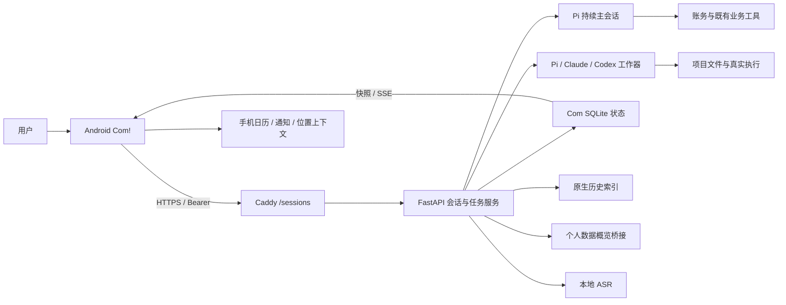
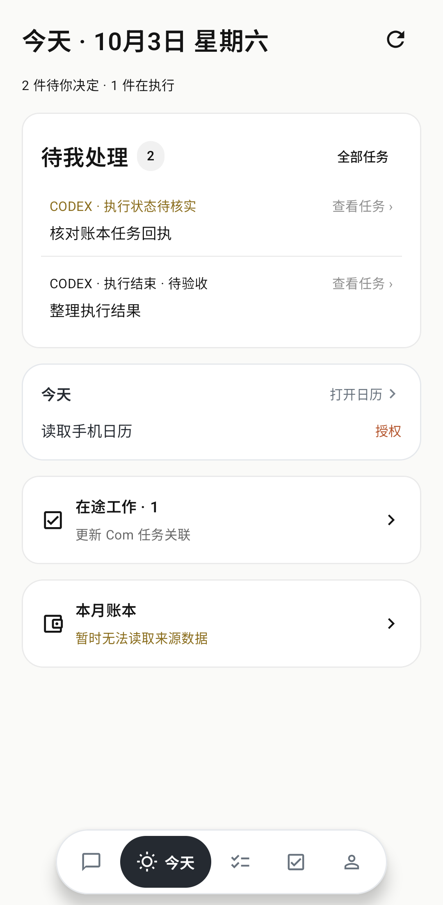
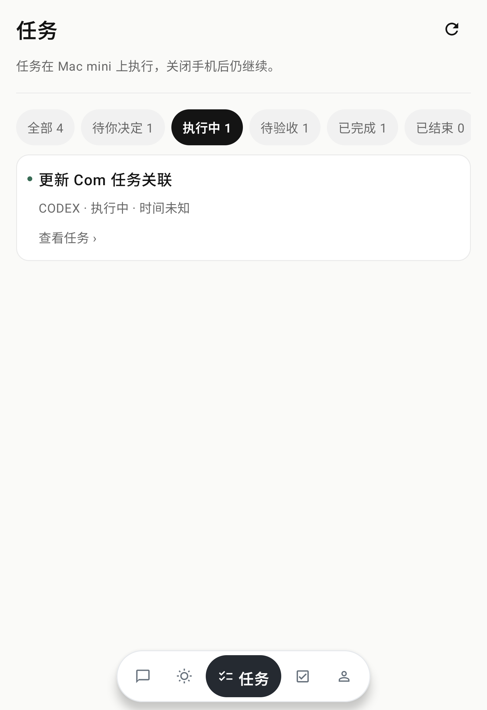
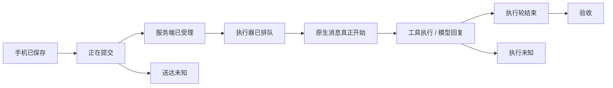

# Com! 当前版本：1.9.1 / versionCode 22

2026-10-04。当前交互更新与验证见 [1.9.1 说明](COM_1.9.1_INTERACTION.md)；后端继续为 1.9.0 / API 契约 2，其他升级与未实现范围见 [1.9.0 说明](COM_1.9_UPGRADE.md)。下文保留 1.8.2 及更早版本的历史增量和详细基线；不要把旧版本、提案或未提交修改当作当前实现。

---

# 历史增量：Com! 1.8.2 / versionCode 20

2026-10-03，主页阅读空间优化；后端保持 1.8.1。

- 删除输入区上方“记一笔／今日日程”快捷按钮，压缩输入区及底部导航的空白；导航仍在下方，保留三项入口与原点击面积。
- 去掉顶部整条渐变遮罩，仅头像和更多按钮保留半透明淡底。缩小头像与状态条，正文滚动时能从控件旁的空白区域透出。
- 检查 411dp／686dp 宽度、1.5 倍字号、长正文和真实键盘；同证书覆盖安装到 Xiaomi 折叠手机，保留数据和配对，实机截图确认顶部正文透出。详情见 COM_READING_SPACE_182.md。

---

# 历史增量：Com! 1.8.1 / versionCode 19

2026-10-03，旧 Kotlin/Compose 工作台。M3–M7、B1–B3实现及部署；B0评估、B4–B6方案见 COM_B_DELIVERY_REPORT.md。后面的1.8.0/1.7.0说明保留为历史。

- 台账四类：等我／在办／待确认／已结束，验收完成和停止仍在卡内明确区分；人工工作聊天不进入台账或Judge。
- 改为新事项保留原正文与真实来源，单独持久 new_item 元数据防止再次归入原补充；未知原送达不重放。原库仅新增可空元数据列，不重写旧记录。
- 设置→主动观察：影子记录、暂停、手动受限开关（先两次成功影子验证）；今天→仅供知情只展示受限speak，没有系统推送。目标调度保持关闭。
- POST /personal/heartbeat/settings；GET /personal/heartbeat 含最近观察与 shadow_verified。清单在项目根 HEARTBEAT.md。
- GET /personal/reminders；POST /personal/reminders/{id}/action：真实记录四动作与回读。创建提醒仍沿既有remind扩展，对话卡按真实 tool result ID关联，今天列待提醒。
- 新版同证书覆盖安装保留数据／配对；不升级Pi、不引入第三方包、不自动晋升技能、不更改记忆注入或凭据保管。

---

# 历史增量：Com! 1.8.0 / versionCode 18

2026-10-03。本文后面的 1.7.0 内容是历史基线，当前差异以本节及 M0–M6 报告为准。

一级入口：对话、今天、工作；更多在顶栏。台账、任务详情、通知巡检是二级页，返回到实际来源。
对话：真实 job 沿来源挂内联卡；工具过程独立；人工工作聊天不进入任务台账或 Judge。今天：决策与知情分区。
详情：真实事件进度、主操作、结果/产物、人话步骤、补充、折叠来源、执行会话与原消息入口。
补充：POST /personal/tasks/{task_id}/inputs/{input_id}/new-item，未送达可撤销，送达中/已送达/未知只另开，不自动重放。
能力：复用 capability_search 只读查询，验证字段缺失明确返回 null。
无历史数据迁移；保留 request_id、来源、outbox、配对、未知不重放；完整操作权限不变。
安装与验收结果见 docs/COM_MUSE_REFACTOR_M7.md；没有发布 tag 或 push。

---

# Com! 当前产品、功能页面与 Agent 协作开发说明

> 文档日期：2026-10-03，Asia/Shanghai。
>
> 源码基线：`6d5abb10ffd8c8aac8dc8f8d6208ea3ad3609342`，Com! **1.7.0 / versionCode 16**。
>
> 本文面向准备参与 Com! 产品优化、页面重组、交互设计及工程改造的 Agent。它记录当前实现及验证范围，并给出可独立开展的优化方向。它不是新的全局 `AGENTS.md`，也不会自动修改任何 Agent 的原生行为配置。
>
> 本次编写重新核对了 Android 与后端源码、Git 状态及 Mac mini 在线 `/health`：主线为 Pi，主线与工作器均为 `full-access`，目标定时调度关闭。构建、原生执行和安装结果引用本轮已保存的验收证据，并未在编写文档时重新启动手机 App 或重新跑生产写操作。
>
> 写作结束时，工作区已有 **1.7.1 / versionCode 17 的未提交修改**：主对话输入区移除“＋”入口，任务详情把来源／约束和时间线折叠。本文的测试数字、APK、截图及已安装版本仍指已验证的 1.7.0；进行中的变化见 2.4。接手前必须检查最新 Git diff，不能将这些修改自动视作已构建、已部署或已验收。

## 阅读导航

| 你要做什么 | 先看哪些章节 |
| --- | --- |
| 理解这个 App 的目标和现状 | 1—4 |
| 优化功能页面与信息架构 | 5—12、24—25 |
| 优化角色、状态提示、视觉与动效 | 6、13—14 |
| 修复消息、语音、任务卡住或重复执行 | 15—19、22—23 |
| 接手 Android 开发 | 20、26—27 |
| 接手 Pi／Codex／Claude 和后端 | 16—22、26—27 |
| 开始多 Agent 分工 | 28—30 |

---

## 1. 产品定位

Com! 是 Eddie 自己使用的 Android 个人 Agent 工作入口。手机负责对话、语音、查看状态与提出要求；Mac mini 负责实际模型运行、工具执行、任务调度和结果保存。

它同时承担三种用途：

1. **随时交谈和办事**：通过 Pi 对话或快捷语音，查询账目、记录具体费用、使用既有业务工具、提出项目要求。
2. **持续跟进工作**：查看原交办对应的工具过程、后台任务、等待原因、结果与验收状态，给同一事项补充要求。
3. **主动使用开发 Agent**：在工作页选择 Claude Code 或 Codex，选择真实项目目录，直接聊天、查询或执行工作。

当前不是一个只有聊天 UI 的静态演示。它连接了真实原生 Agent、会话文件、SQLite 任务台账及账务系统。但它也不是已经完成多人协作、跨平台商业化和完整手机自动化的通用平台。

### 1.1 这次交接对应哪个项目

| 项目事实 | 当前值 |
| --- | --- |
| 产品名 | Com! |
| Android applicationId／namespace | `work.eddie.sessions` |
| 主要前端技术 | Kotlin / Jetpack Compose |
| 后端技术 | Python / FastAPI / SQLite |
| 开发目录 | `/Users/eddiegao/AI_Work_System/work/工具与效率/会话工作台` |
| Git 基线 | `6d5abb1` |
| 已验证 Android 版本 | 1.7.0，versionCode 16；工作区正在修改为 1.7.1 / 17 |
| 常驻执行主机 | 家中的 Mac mini |
| 当前主对话 Agent | Pi |
| 工作页 Agent | Claude Code、Codex |
| 已确认的外网入口 | `https://pi.eddiegao.work:8443/sessions` |

另有以 OpenMuse 为基础的独立 Coms 工程。**本文描述的是 `work.eddie.sessions` 这套现有 Android Com!**。参与本项目时，应先核对包名和仓库；不要把 Expo/Hono 的独立 Coms 工程当成本仓库的现有前端。

### 1.2 用户对“优化”的实际期待

用户希望其他 Agent 进入协作，优化整个 App 的功能安排、页面布局和使用体验。可以提出并实现新的布局方案；本文件列出的页面结构是起点，不是要求永远冻结。

已确认、仍有参考价值的偏好：

- 功能导航放在底部。
- 主体使用白色／浅灰表面、黑灰线性图标和清晰文字。
- 卡通角色保留个性与动效，但内容和操作要容易理解。
- 普通问题要尽快获得实际回答，不能被无必要的任务派发阻塞。
- 聊天、语音和主动进入工作页都是有效的使用入口，不要求每句话改成机械的“明确交办句”。
- 任务进展、送达、执行结束和验收状态要真实，不能把“收到”画成“做完”。
- “做好／修好／能用”包含运行结果和实际使用路径验证。

新一轮设计若改变这些已确认偏好，应说明改变的用途与影响；日常可回滚的布局选择和实现细节可以自主推进。

## 2. 1.7.0 刚完成了什么

### 2.1 已实现的变化

| 变化 | 当前行为 |
| --- | --- |
| Muse 三张卡 | 工作过程卡、角色状态卡、结果总结卡已进入现有 Android 工程 |
| 手机消息队列 | 每条消息持久保存自己的正文、引用与稳定请求 ID；草稿、发送回执和快照刷新分开 |
| 连续对话 | Pi 原生会话保持连续；明确关联当前事项的补充使用原生 steer |
| 普通语音记账 | 不再因为 `voice_purpose=conversation` 就阻止完整、明确的费用记录 |
| 历史查账 | `bookkeeping_search` 按日期、金额或备注查真实历史，不再只看最近 30 笔 |
| 工作页普通聊天 | Claude／Codex 可以直接接收问候、问题和讨论，不再只形成候选草稿 |
| 最高操作权限 | Pi、Codex、Claude Code 统一完整操作权限；旧只读限制撤销并保留审计 |
| 今天／任务改版 | 今天显示待处理、今日时间轴及摘要；任务采用同一台账与状态筛选 |
| 原消息定位 | 任务来源区分主对话消息与真实工作会话的原生消息 |
| 结果验收 | 程序检查可以覆盖完成条件；按需增加独立、无工具 Judge |

### 2.2 已验证的范围

| 验证层 | 1.7.0 已保存的结果 | 能证明什么 |
| --- | --- | --- |
| mini 后端测试 | 372 项通过 | 受测业务、状态、来源、去重和迁移逻辑 |
| MBP 后端测试 | 369 项通过，3 项因本机缺可选 MCP 依赖跳过 | 本机对应检查；mini 已覆盖这些 MCP 检查 |
| Android JVM | 58 项通过 | 受测映射、队列、筛选及纯逻辑 |
| 宽屏 UI | 10 项通过 | 最终包对应源码的模拟器点击与布局路径 |
| 窄屏 UI | 13 项通过 | 今天／任务、来源按钮、发送保护和状态头部路径 |
| Pi 原生 worker | 真实 write → read 通过 | 原目录写入、完整回读、来源绑定、旧只读要求无执行效果 |
| Codex／Claude 原生工作聊天 | 两轮写入／追加／回读通过 | 同原生会话连续工作，重复请求回执不会再执行一轮 |
| 原生历史查账 | 5.055 秒，一次查询，零后台任务 | 当前工具集下可以直接查询真实账本；不是性能 SLA |
| 普通语音记账意图 | 两个费用案例各添加一次，能力问句和引用不添加 | 真实 Pi + 临时账本夹具上的意图／金额／回执逻辑；未向生产账本添加测试账 |
| mini 服务 | 本地与公网健康检查、HTTPS、SSE 通过 | 实际常驻服务及外网路径可用 |
| 权限迁移 | 当时 17 个任务状态、结果及来源不变 | 撤销权限限制不会重放未知操作 |
| 手机覆盖安装 | 同签名、已安装 APK 与构建包哈希一致 | 最终产物已安装，配对及原 App 数据保留 |

### 2.3 还不能写成“已经完全验证”的部分

- 最终 1.7.0 包安装时没有在实体手机前台启动、发送新消息或录制真实语音。
- 手机实际口述、ASR、噪声环境、折叠切换、触觉及系统后台限制仍需现场使用验收。
- 原生费用记录验收用临时账本，不能据此宣称某笔历史失败费用已经自动补记。
- 模型一次查询耗时约 5 秒，不代表所有问题都固定在 5 秒内完成。
- Google Calendar 桥接、手机本地日历、通知和位置是不同数据链路，某个入口可用不能代替其他入口的验收。
- 图片中的测试记录是模拟器夹具，不是用户的实时任务和财务数据。

工程实现、服务可用、APK 安装与真实手机使用分别记录，后续 Agent 也应保持这个区分。

### 2.4 写作期间出现的进行中修改

以下来自本地未提交 diff，单独记录，尚未纳入上面的 1.7.0 验收结论：

| 文件 | 进行中的变化 | 接手时要核对 |
| --- | --- | --- |
| `android/app/build.gradle` | versionName 改为 1.7.1，versionCode 改为 17 | 是否已提交、构建并实际安装 |
| `HermesChat.kt` | 移除主输入区左侧的“＋ / 查看活动与工作建议”按钮 | 更多与任务入口是否仍可达，输入区尺寸及相关 UI 测试 |
| `TaskLedger.kt` | 当前阶段／最近一步／完成条件优先；结果字号增大；来源与约束、输入和事件时间线分别折叠 | 详情展开、控制按钮、来源定位、返回及大字体布局 |

这属于同一工作区的后续调整。不要覆盖或回退这些修改；也不要把本文中的 1.7.0 截图误当成它们的最终预览。第 8 节和第 24 节描述的详情密度问题，已有此进行中方案尝试解决，接手时先核对最终效果。

## 3. 产品系统组成



Android 不是模型运行主机。退到后台或关闭手机不会直接终止已经交付到 mini 的工作任务；但尚未送出的手机录音、消息队列与系统 WorkManager 调度仍受 Android 自身生命周期影响。

### 3.1 名称兼容造成的阅读陷阱

代码中保留了 `HermesChat.kt`、`PersonalConversation`、`HermesClient` 等旧名字。

- 当前生产主线已经是 Pi。
- `HermesChat.kt` 当前渲染的是主页 Pi 对话。
- `conversation.py` 管理的是 Com 主对话的持久消息与消费流程。
- 没有 `agent-config.json` 的新环境仍可能走 Hermes 兼容入口。
- 不应仅凭文件名判断生产实际使用哪个 Agent。

同样，旧 `sandbox`、`business-read`、`read_only` 字段可能出现在历史记录中。当前执行权限由 1.7.0 的有效策略决定，旧字段不能直接作为只读操作限制重新启用。

## 4. 当前信息架构

### 4.1 五个底部入口

| 用户看到的入口 | 内部主要路由 | 页面职责 | 最关键的数据 |
| --- | --- | --- | --- |
| 对话 | `hermes` | 与持续 Pi 交流，交办与补话，读取回复及关联状态卡 | 主对话消息、运行状态、关联任务 |
| 今天 | `sources` | 我现在需要处理什么，以及今天的时间安排和摘要 | 任务、主对话异常、手机日历、账本概况 |
| 任务 | `activity` | 查看所有后台工作的唯一台账与对应详情 | `/personal/tasks`，补充 proposal 与消息关联卡 |
| 工作 | `work` | 主动使用 Claude Code／Codex，在项目目录内聊天和执行 | 原生工作会话、模型目录、实时输出 |
| 更多 | 底部入口打开 sheet | 日历、账本、通知巡检、权限与上下文、设置 | 对应来源、权限与连接配置 |

“更多”主要是底部弹出的菜单，不是一个与其他四页完全相同的独立全屏主页面。

### 4.2 二级页面与覆盖层

```text
Com!
├─ 对话
│  ├─ 消息回复／引用预览
│  ├─ 工作过程卡
│  ├─ 总结卡
│  └─ 关联任务详情
├─ 今天
│  ├─ 待处理条目 → 对应任务／原消息
│  ├─ 今日日历时间轴 → 完整手机日历
│  ├─ 在途工作 → 任务的执行中筛选
│  └─ 本月账本 → 账本详情
├─ 任务
│  ├─ 状态筛选列表
│  └─ 单任务详情
│     ├─ 具体审批／补充／停止／继续
│     ├─ 进入执行会话
│     └─ 返回真实原消息
├─ 工作
│  ├─ 新会话：Agent／项目目录／模型／正文
│  ├─ 已选原生会话：消息／工具／补充
│  ├─ 工作会话历史 sheet
│  ├─ 模型与推理面板
│  └─ 终端（按会话真实能力开放）
└─ 更多 sheet
   ├─ 日历
   ├─ 账本
   ├─ 通知巡检
   ├─ 权限与上下文 sheet
   └─ 设置 sheet

独立系统入口：
├─ QuickVoiceActivity：助手快捷语音小窗
└─ ExpenseVoiceActivity：专门语音记账小窗
```

## 5. 对话页：Pi 持续主线

主要实现：`HermesChat.kt`、`HermesCompanion.kt`、`HermesHero.kt`、`Store.kt`。

### 5.1 页面从上到下的组成

1. 左侧圆形菜单按钮。
2. 中央 Pi 卡通形象。
3. 有活动时，在形象下方显示小状态框。
4. 右侧活动入口，进入统一任务页。
5. 消息列表：用户正文、Pi 回复、引用、表情反馈、工作过程及结果卡。
6. 底部引用预览与输入区。
7. 五项底部导航；与键盘、系统导航条和安全区配合。

列表、头部和输入区的布局互有关联。头部高度变化后，列表上方留白也要同步变化，否则会再次出现人物、状态和第一条消息重叠。

### 5.2 消息能力

- 用户消息和 Pi 回复保留稳定身份与时间。
- 回复支持 Markdown。
- 消息可作为回复／转发引用，发送前显示引用预览。
- 工具过程和后台任务挂回对应消息，不只在独立任务页显示。
- 通过 SSE 获得流式和状态变化，并保留快照恢复路径。
- 可以查看尚未送达、失败或未知状态，草稿与已提交正文分别保存。
- 表情反馈及触觉提示有专门组件，不应作为完成证明。

### 5.3 输入和连续补话

普通正文与明确工作要求均可发送。发送后先保存独立请求，再释放输入框；上一条还在执行时，用户可以继续写下一条。

服务端会区分：

| 类型 | 当前处理 |
| --- | --- |
| 与当前执行事项明确关联的补充 | Pi 原生 steer；消息真正开始后切换授权来源 |
| 独立的新问题／事项 | 保留独立消息与排队语义，不强行并进前一项 |
| 对某条消息的回复 | 沿真实引用关系关联 |
| “继续”但没有可确认对象 | 不编造原事项，保留需要定位对象的状态 |
| 已送达结果未知 | 先核实，不自动重新执行 |

连续对话不是“所有消息都并发跑一个模型回合”。任务工作器可并行，持续主会话仍有原生会话的执行和队列语义。

### 5.4 主对话中的语音

输入区有录音、停止录音和转写状态。录音时输入正文暂时不可编辑，避免识别结果覆盖正在修改的文本。

普通语音的完整费用陈述可以直接进入记账判断。专门记账入口继续存在，但不是唯一授权入口。

### 5.5 空白、离线和未知状态

- 无消息时有角色欢迎／建议入口。
- 缓存内容可以展示，但标注连接／同步状态。
- 空闲时人物保留，状态框隐藏。
- 离线、连接中和执行未知有不同文字。
- 历史未知任务不会永远覆盖当前真正执行中的人物状态。

## 6. 三张状态卡与角色提示

### 6.1 工作过程卡 `AgentWorkCard`

它用于展示一条消息实际关联的任务与事件，例如工具调用开始／结束、任务启动、补充输入及对应后台任务。

- 数据来自服务端 `message.tasks`、`linked_tasks` 与 `work_events`。
- 工具事件要有真实调用身份和开始／结束关系。
- 收到工具开始但没有结束事件，不能直接显示完成。
- 点击真实 task ID 进入其详情。
- 缓存与实时状态应区分。

### 6.2 角色下方状态框 `AvatarStatusPill`

最新用户要求已实现：

- 没有活动时隐藏整个状态框。
- 删除框里的 Pi 名字。
- 仅保留灰色状态图标和当前状态文字。
- 状态框在人物下方，靠近人物，不能压住角色。
- 使用当前执行／工具阶段推导文字，不从 Agent 的完成宣称推导。

当前组件通常使用一个灰色工具图标搭配文字，并不是所有业务各有一套完整的语义图标。

已实现的典型状态包括：拉取代码、开始修改、搜索资料、查看日历、努力思考、努力工作、正在回复、正在倾听、正在转写、等待回应、状态待核实、离线记录等。

当前主对话代码在窄／宽屏根据可用宽度调整边距；忙碌头部高度也随字体缩放调整。后续设计不能只用一张正常字号截图验收。

忙碌状态参考：


空闲状态参考：


### 6.3 总结卡 `TaskSummaryCard`

展示完成后的步骤时间线、结论、产物和复制入口。

需要区分四件事：

1. Agent 停止输出。
2. 当前执行轮结束。
3. 完成条件经证据检查通过。
4. 如存在历史工作副本，当前轮的产物已经合入。

最高权限的新任务直接在原目录工作；历史副本继续按真实 run 验收与合入。取消权限限制不会把旧副本自动变成已交付。

## 7. 今天页：待处理与时间安排

主要实现：`PersonalOverview.kt`、`TodaySections.kt`、`PhoneCalendar.kt`。

### 7.1 实际布局

```text
今天 · 日期／星期                  刷新
N 件待你决定 · M 件在执行 · 可用时显示今日支出

待我处理                           全部任务
  需批准／待核实／失败／待验收条目   查看任务
  ……超过首屏条目时显示查看其余

今天                               打开日历
  手机今日日程／全天事项折叠／日历权限状态

在途工作 · M                       →
  任务标题摘要

本月账本                           →
  本月支出、今日支出或真实来源错误
```

当前在途工作与账本已压缩为摘要行，但仍放在独立的圆角表面内。旧调研中的“完全不做卡片”是方案目标，不能写成已全部实现。

### 7.2 待处理条目的数据组合

数据包括：

- Task ledger 中的待批准、等待、暂停、未知、失败、待验收任务。
- 没有对应 ledger 的主对话运行异常。
- 没有被已有任务／运行记录覆盖的主对话失败消息。
- 重要通知巡检结果，作为仅供查看的条目。

同一任务按实际 ID 去重。已关联任务的主消息不再额外作为一个重复待处理事项出现。

当前显示排序：需批准 → 需处理／核实 → 失败 → 待验收 → 通知知情。首卡最多直接显示三项，其余通过入口继续查看。

**实际限制**：通知知情条目不计入“待你决定”的数量，但仍可出现在同一卡片。这是后续产品分层可以进一步优化的地方。

### 7.3 点击与返回

| 条目 | 点击后的实际去向 |
| --- | --- |
| 有真实 task ID | 对应任务详情 |
| 无任务但有主对话消息 ID | 主对话，并定位那条消息 |
| 通知巡检结果 | 通知巡检页 |
| 在途工作摘要 | 任务页，执行中筛选 |
| 账本摘要 | 账本详情 |
| 今日日历 | 完整手机日历页 |

从今天进入任务详情后，返回到今天。不是每次都回主聊天，也不是清空 task ID 后只打开一张任务总列表。

### 7.4 两个日历来源不能混淆

| 来源 | 使用位置／链路 |
| --- | --- |
| 手机 Calendar Provider | 当前今天时间轴及手机日历页，依赖 Android `READ_CALENDAR` |
| mini Dashboard 的 Google Calendar 概览 | `/personal/overview` 保留的桥接字段及旧兼容组件 |

手机日历“没有权限”、手机日历“今天没有日程”、远端桥接不可用是不同状态。页面优化应分别处理。

示意截图使用本地测试夹具；其中日历未授权、账本不可用是夹具状态，不代表当前生产财务服务故障。



## 8. 任务页：唯一台账与对应详情

主要实现：`TaskLedger.kt`、`WorkProposalSection.kt`、`Store.kt`。

### 8.1 列表的数据来源

前端将以下来源合成一份列表：

1. `/personal/tasks` 的完整 task records，优先。
2. 主对话消息的 `linked_tasks`，作为消息级快照补充。
3. 没有同 ID task record 时的 proposal 记录，作为历史兼容补充。

以真实 `id` 去重。proposal 已 accepted 但完整任务状态未到时，显示“已派发 · 任务状态待核实”，不能据此显示完成。

### 8.2 状态筛选

| 筛选 | 主要对应情况 | 注意 |
| --- | --- | --- |
| 全部 | 所有记录 | 不是另建一套台账 |
| 待你决定 | 等待、审批、暂停、未知、失败等 | 未知需要核实，失败不总能无条件重发 |
| 执行中 | 已受理排队、派发、运行、取消待确认等 | 排队不等于原生 Agent 已开始 |
| 待验收 | 执行结束但未真实验收通过 | 不等于任务失败 |
| 已完成 | 满足 acceptance 判定的结果 | 需要程序证据及可能的评审／合入条件 |
| 已结束 | 停止、拒绝、过期等 | 不能冒充完成 |

`waiting` 当前进入“待你决定”筛选，即使部分旧展示字段仍属于 active 分类。改造时要查看 `ledgerGroup()`，不要只看 `LedgerTask.status`。

### 8.3 列表与详情的分层

列表当前显示：标题、执行者、状态、更新时间、必要等待原因、查看任务入口。

详情当前包含：

- 工作范围与目录。
- 目标、完成条件、阶段、最近一步。
- 真实交办原文。
- 历史约束与补充输入送达记录。
- 按实际任务状态显示的允许／拒绝、继续、补充、停止等操作。
- 进入实际执行会话。
- 来源已确认时返回对应原消息。
- 结果文字、事件时间线、完整执行指令。

**实际限制**：虽然列表已简化，详情中字段和时间线仍比较密集；结果主要是可选中的文字，尚未形成一致的文件预览／产物操作中心。

### 8.4 各动作的语义

| 操作 | 含义 |
| --- | --- |
| 补充要求 | 沿当前任务入持久输入队列，之后区分已受理、送达、未知 |
| 请求停止 | 发出取消请求，真正终止后才显示已停止 |
| 继续这项任务 | 对启动前暂停等可确认状态重新检查环境／恢复原对象 |
| 允许／拒绝 | 针对对应 proposal 的具体动作，不能泛化为整个任务永久授权 |
| 进入执行会话 | 打开实际 worker session；不是另派一份任务 |
| 回到交办消息 | 按已确认来源定位原文；不伪造原生消息 ID |

当前没有完善的“待验收 → 手机端填写检查 → 一键运行验收”的通用 UI。后端有验证接口及模型工具，用户可以在对话中要求检查；任务页仍是明确可优化的入口。



## 9. 工作页：Claude Code／Codex

主要实现：`ConversationScene.kt`、`ChatUI.kt`、`MainActivity.kt`、`Store.kt`。

### 9.1 新会话

- 选择 Claude 或 Codex。
- 选择 mini 上实际存在的项目工作目录。
- 可选择原生模型与模型支持的推理档位；列表来源于服务端。
- 输入普通聊天、问题或工作要求。
- 会话以完整操作权限运行。

在当前 Pi 主线模式下，工作页创建的任务要求目录位于 `AI_Work_System` 内。底层某些旧 Runtime 路径还有用户主目录校验，不能把两层校验写成完全相同的范围。

工作页不提供另一个 Pi 主页入口；Pi 主线工作从对话页交谈或交办。

### 9.2 普通聊天与后台委派是不同入口

| 入口 | 当前判断 |
| --- | --- |
| 用户在工作页主动向 CC／Codex 发消息 | 可信人工聊天，可以是问候、问题或讨论 |
| 主 Pi／模型调用 `task_submit` 派后台任务 | 仍需真实用户原文与任务意图支持 |

最高权限不应该重新变成“用户一句你好也得补充执行动词”。同时，也不能让模型把引用、愿望或一句你好伪造成一项自动后台工作。

工作页的后续消息可以沿同一会话继续，不要求每一轮自然聊天先经过项目验收。

### 9.3 会话阅读、历史和终端

- 固定页头显示工作入口及历史按钮。
- 历史 sheet 支持会话搜索、筛选、选择和管理。
- 展示已保存的原生消息与实际实时输出。
- 当前 managed 会话可以按真实能力继续输入、停止或结束。
- 不属于 Com、正在别处占用或身份不明的会话，不能伪装成已接管。
- 终端是补充入口，使用本地 xterm 资源和后端 WebSocket；是否可用由当前会话能力决定。
- 原生历史浏览本身不应启动新的模型回合。这个“读取不产生执行”规则与已撤销的操作只读限制是两件不同的事。

### 9.4 工作页当前可优化的地方

- Agent、目录、模型与首条消息的关系可以更直观。
- 普通聊天结束后仍对应执行结束／待验收 task records，可能造成项目任务与自然聊天混杂。
- native session、task ID、UI route 和消息锚点需要稳定契约，不能只用标题匹配。
- 某些文案仍保留旧名称或“补充约束”的技术措辞。
- 终端、工具卡和正文的切换需减少认知负担。

## 10. 更多与个人数据页面

### 10.1 日历

当前入口展示手机可见日历的日程，按需申请日历读取权限。今天页是当天时间轴摘要，完整页面承载更完整的日历查看。

不要把“可以读取本地日历”写成“任何来源的日程均可新增、修改、删除并已验证”。业务扩展可能有日程工具，但实际写入能力和来源要单独核验。

### 10.2 账本

账本页面通过 mini Dashboard 的 finance 概览展示已有数据，包括币种、月度／今日支出等；数据有来源、更新时刻及可用状态。

这与 Pi 对话中的记账写工具、`bookkeeping_search` 历史检索是不同接口。概览异常不等于整个记账客户端不可用；历史检索成功也不等于概览桥接正常。

当前账本 UI 不是一个已经完成全套流水筛选、逐笔编辑、统计图表与撤销操作的独立记账客户端。

### 10.3 通知巡检

- Android NotificationListener 获取用户开放范围内的新通知。
- 手机做敏感通知过滤、去重及加密队列。
- 发到 mini 后由巡检流程产生摘要／建议草稿。
- 当前是查看与辅助判断链路，不是一个已经开启自动回复的消息机器人。
- 1.7.0 已从任务总页面分离到更多中的独立页。

当前通知巡检页返回逻辑偏向今天页。若下一轮重组“更多”中的二级导航，应检查不同入口的返回目的地是否符合预期。

### 10.4 权限与上下文

| 能力 | 手机侧当前行为 | 使用边界 |
| --- | --- | --- |
| 麦克风 | 快捷小窗与主对话录音 | 需系统授权 |
| 日历 | 本地 Calendar Provider 读取 | 未授权、无日程、读取失败分开处理 |
| 通知 | NotificationListener + 过滤／队列 | 系统通知读取权限与普通通知发布权限不同 |
| 联系人 | 本地解析联系人／号码 | 不等于自动上传整本通讯录 |
| 位置 | 按需读取、显示状态、分享开关 | 页面能力说明不等于迟到提醒等主动闭环均已验收 |

Com 里的“最高 Agent 操作权限”作用于 mini 执行器，不能替代 Android 系统授予麦克风、日历、通知、Shizuku 或 Root 权限。

### 10.5 设置

主要用于 HTTPS 服务地址、配对和现有显示／工作偏好。手机仅接受 HTTPS 地址。

当前没有多用户账号、团队 RBAC、云端租户管理或应用商店式服务发现。

## 11. 快捷语音与专门记账小窗

主要实现：`QuickVoiceActivity.kt`、`QuickVoiceDelivery.kt`、`ExpenseParse.kt`、`UnifiedVoice`、`voice.py`。

### 11.1 普通快捷语音

Android 系统助手的 `ASSIST` 入口启动 `QuickVoiceActivity`，是独立的小窗，不需要先打开主 App。

流程：

```text
呼出小窗
→ 根据权限开始录音
→ 结束／停顿后进入转写
→ 稳定 capture ID 上传 M4A
→ 接收 ASR 正文
→ 用稳定 request ID 提交 Pi 主对话
→ 验证受理回执
→ 后台继续处理，在主对话／任务中跟进
```

1.7 的小窗文案中还存在“可在工作页查看结果”等旧措辞；当前持续 Pi 主线结果主要在主对话与关联任务。下一轮可以统一路径文案，但需要沿实际跳转代码验证。

### 11.2 专门语音记账入口

`ExpenseVoiceActivity` 复用小窗基础能力，增加金额／用途预览与确认步骤。源码有 3 秒倒计时确认逻辑；普通会话费用也可直接记账，因此这个入口属于更明确的交互方式，而非唯一允许写账的模式。

确认／倒计时、重说、关闭、未知送达和后台恢复需要组合验收，不能仅看 `ExpenseParse` 单测。

### 11.3 ASR 与业务提交分开

- `/voice/transcribe/{capture_id}` 只转写，不能在这个端点直接创建 Agent 任务。
- 录音标识与音频内容摘要绑定，重复上传相同内容返回已有转写。
- 同一个 capture ID 换成不同音频会被拒绝。
- 目前接收 M4A / `audio/mp4`，单次上限 5 MiB。
- mini ASR 默认上游是本机 `127.0.0.1:8647/transcribe`。
- ASR 本地运行不意味着后续模型推理全程离线。

### 11.4 真实语音验收建议

至少检查：安静／有噪声、金额带小数／中文角分、短暂停顿／长停顿、录音中关闭、转写中切后台、重复呼出、网络断开、服务已收但手机没收到回执、同一录音重试。

验收录音转写、业务执行与数据变化时，应分别给出证据，避免只有“工具被调用”的日志。

## 12. 目前没有形成完整产品的能力

| 能力 | 当前结论 |
| --- | --- |
| 独立个人 todo | 当前没有与 Agent tasks 分离的完整个人待办实体／页面 |
| 目标定时主动推进 | 有 goals／events 基础设施；当前定时调度关闭 |
| 通用手机 UI 自动化 | 当前不是 Com 已经完成验收的标准页面能力 |
| Shizuku／Root 全设备控制 | 不属于仅靠 mini 最高权限就自动完成的能力 |
| 多人团队协作账号 | 没有团队账号、角色分权和租户模型 |
| 完整账务 GUI | 当前以概览和 Agent 记账／查询为主 |
| 统一产物中心 | 总结与 artifacts 存在，但没有完善的全局产物浏览／预览／操作中心 |
| 通用手机验收面板 | 后端检查工具已存在，手机交互还不完整 |
| 所有历史会话无条件接管 | 原生身份、占用和 transport 能力仍需检查 |
| 多模型 Judge 编排 | 当前是按需 Pi／Flash 的独立无工具评审，不是无限评审系统 |
| 多平台商业发布 | 当前以现有 Android 手机 + mini 自用环境为主 |

这些可以成为后续设计方向，但要标明新增数据、系统权限或架构需求。

## 13. 视觉系统与布局基线

主要定义：`Theme.kt`、`ComIcons.kt` 及页面内 Compose 布局。

### 13.1 颜色与表面

| Token | 当前值／用途 |
| --- | --- |
| `Paper` | `#FAFAF8`，页面暖白背景 |
| `Card` | `#FFFFFF`，内容表面 |
| `Ink` | `#141414`，主要文字和选中状态 |
| `Muted` | `#686868`，次要文字与图标 |
| `Faint` | `#909090`，辅助状态 |
| `Line` | `#EAEAEA`，轻描边／分隔 |
| `ChipBg` | `#F1F1F1`，未选中筛选等 |
| 用户／助手气泡 | 灰色为主；Pi 主对话仍有浅绿／浅灰米色区别 |
| `PiGreen` | `#396C55`，局部运行／成功提示 |
| Amber | 等待、核实、审批等局部提示 |
| `Danger` | `#B24A3D`，错误／录音等状态 |

普通内容卡片以表面和轻描边分层。悬浮底栏、sheet、角色提示可使用有限投影；不是全屏强玻璃／高饱和渐变语言。

### 13.2 设计刻度

- 间距：4、8、12、16、20、24、32 dp。
- 常用圆角：8、12、16、20、24、28、32 dp；pill 另定义。
- 正文：16 sp；次正文 14 sp；辅助 12 sp；微型文字 11 sp。
- Sheet／App 标题基础 22 sp；页面局部仍存在 20／23 sp 等直接值。
- 字体以系统无衬线为主。

这些 token 已存在，但页面仍有不少直接写数值的代码。后续统一设计系统时应逐步减少旁路，不只是再新增一套 token。

### 13.3 适配与键盘

- 主对话在 700 dp 左右切换部分宽屏行为，消息列限制宽度。
- 今天／任务主要内容列限制最大约 820 dp。
- 消息泡、状态框、角色和工具卡各有自己的宽度规则。
- 根布局处理 status bars、navigation bars 和 IME。
- 输入法出现时底部导航由专门组件协调。
- 当前采用自适应单列为主，不能把“支持宽屏”写成已有完整双栏平板信息架构。

下一轮布局验收至少包含：窄屏、宽屏、字体放大、键盘打开、长标题、无数据、缓存、真实错误、详情返回和原消息定位。

## 14. 角色、动效与触觉

主要模块：`HermesCompanion.kt`、`CompanionAvatar.kt`、`CompanionCarousel.kt`、`CompanionState.kt`、`MessageSendMotion.kt`、`ComHaptics.kt`。

- Pi 主对话使用当前已有卡通形象；工作入口还保留各 Agent 角色／场景组件。
- 角色有思考、倾听、等待、失败、完成等状态。
- 状态由真实运行事件驱动，不应从缓存中的旧完成任务无限重复播放庆祝。
- 角色场景切换使用 anchor／spring，和消息发送动效存在坐标、生命周期关系。
- 消息发送有 composer → bubble 的动效和列表锚点保护。
- 录音、发送、反馈等使用触觉提示。
- 切后台和系统关闭动效设置需要考虑。

原有角色资产及相关组件有来源／许可证文件。优化角色时先核对 `android/app/src/main/assets/` 与相应 `NOTICE.md`，不要把源码中资产误当成无来源素材。

重点优化方向是角色和信息的配合：内容阅读时克制，真实工作时可感知，等待用户时给出明确动作。可以重新设计动效，但不要破坏输入、滚动和点击区域。

## 15. 消息身份、送达与恢复机制

### 15.1 五种不同的 ID

| 字段 | 用途 |
| --- | --- |
| `request_id` | 一次不可变提交的稳定身份，用于去重、回执、恢复 |
| Com `message_id` | Com 自身持久消息身份 |
| 原生 user item ID | Pi／Codex／Claude 真实会话中的消息身份 |
| `session_id`／`sid` | 实际原生会话／worker 身份 |
| `task_id`／`run_id` | 持久工作对象与本次执行轮次 |

不能把 request ID、任务 ID、Com 消息 ID 和原生消息 ID 相互替代。

### 15.2 手机 outbox

主对话 `ConversationOutboxEntry` 包含正文、引用、状态、服务端消息 ID、创建时间及错误等。存储使用 Android Keystore 支持的 AES-GCM 加密持久化。

行为要点：

- 保存成功后再释放输入框。
- 已提交正文不跟随新草稿变化。
- 每条队列项独立，不能只用一个共享 pending 文本。
- 收到回执后检查 ID／正文等是否对应真实提交。
- 快照拉取失败不应该把已经受理的提交改成“没发出去”。
- 从未尝试网络的本地队列和已尝试但结果未知的队列分开。
- 手动核对未知请求时复用相同 request ID 与相同正文。
- 切后台时真正 flush 尚未写入的草稿／队列状态。

快捷语音还有音频、capture ID、转写缓存和 WorkManager 投递记录，不应只保存主页面上的一份正文。

### 15.3 原生消息来源绑定

Pi RPC staged input 写入私有 context records。只有实际原生 `message_start` 回显对应输入后，工具的当前来源才切换。

HTTP 成功或 Pi steer ACK 只能证明接收／排队，不能提前把正在运行的工具绑定到下一位用户消息。

工作会话使用 `MessagePresentations` 记录 transport text、request ID 和真实回显身份。任务接口只有在确认原生来源后才提供：

```json
{
  "source_session_id": "codex:<native-session>",
  "source_message_id": "<confirmed-native-user-item>"
}
```

未确认时只提供实际工作会话入口，不构造一个看似可点击的假消息锚点。

### 15.4 状态有多层，不可合成一个布尔值



页面应该能回答当前在哪一层、有什么证据、用户可做什么，而不是所有等待都显示“努力工作中”。

## 16. Agent 运行结构

### 16.1 Pi 主线

- `pi_main.py`：Com 主线提示与 client 适配。
- `pi_rpc.py`：启动原生 Pi RPC 子进程、发送输入、消费 JSON 事件、持久原生 session 路径。
- `com-pi.ts`：原生扩展工具 schema、来源选择、调用授权／结果回报、工具加载登记。
- `conversation.py`：Com 消息持久化、SSE、主线消费者、背景结果与消息卡。

当前默认原生 Pi 配置为 `opencode-go / deepseek-v4.1-flash`。这是现有代码／配置基线，不是要求未来不得调整模型。

Com 不复用微信 gateway 的 lane、认证会话或聊天线程。业务能力可以复用现成客户端及已有工具实现。

### 16.2 最高权限下 Pi 工具启用的重要细节

Pi 原生全工具包含 `read`、`bash`、`edit`、`write`、`grep`、`find`、`ls`。同时还需要记账、日历、任务等扩展工具。

1.7 的实测发现：CLI `--tools` 的白名单还会过滤扩展工具，因此只传七个内置名字会让业务扩展不可用。

当前处理：

- 普通 Com main／worker 由环境标识开启官方 `setActiveTools(getAllTools())`。
- 启用实际已加载的内置与正常扩展工具。
- 不修改全局 Pi `settings.json` 的 defaultTools。
- Judge 的实际工具保持为空。
- 不因工具清单里“已安装”就宣称某项业务已经验证。

### 16.3 Codex

- 通过 Codex app-server RPC 管理线程和 turn。
- 模型／推理来自原生接口返回。
- 创建和恢复会话使用完整操作权限和对应审批策略。
- Runtime 保留 tmux／终端等旧兼容入口。
- 原生历史读取不应恢复模型执行；需要输入时才经过占用和身份检查。

### 16.4 Claude Code

- 使用 `claude-agent-sdk`，不是简单把回复文本转贴进 App。
- 使用所选项目原目录。
- 完整权限模式对应 SDK 的 bypassPermissions 及关闭操作沙箱限制。
- 原生模型／第三方 endpoint 按本机配置和 Com 的 `agent-config.json` 读取，不向仓库复制凭据。
- 仍有真实动作 guard、任务来源和预算机制。
- 同一会话的后续消息沿原 native session 继续。

### 16.5 并发与预算

当前后台总体最多两项；Claude 工作器并发最多一项。

Claude 源码还有预算限制：自动任务当日新任务数量、单任务最多十二轮及可配置 Token 阈值。手动工作聊天与自动任务的计数语义有区别。

完整操作权限不等于没有并发限制、成本预算或原生会话占用检查。排队问题诊断必须分别查看这些条件。

## 17. 任务层、补充与结果交付

### 17.1 持久任务对象

关键字段：

```text
id / title / agent / cwd
status / block_reason / session_id / run_id
origin_session_id / origin_message_id / origin_request_id
source_links / source_message_ids / latest_user_message_id
context_revision / work_brief
completion_condition / acceptance_criteria
authorization / sandbox / operation_policy_revision
inputs / events / result / artifacts / structured_result
verification_status / quality_review / quality_reviews
workspace_copy / merged_run_id / previous_operation_scope
```

`work_brief` 与 `context_revision` 用来描述当前要求版本，不能只保留最初一条模型概括的标题。

### 17.2 典型状态

| 任务状态 | 含义 |
| --- | --- |
| `queued` | 已保存，等待执行条件 |
| `dispatching` | 启动／提交执行器阶段 |
| `running` | 当前实际工作轮运行 |
| `waiting` | 等待用户回应或相关条件 |
| `paused` | 在明确发送前失败等可核实情况下暂停 |
| `cancel_requested` | 已请求停止，尚未确认结束 |
| `execution_finished` | 执行结束，验收独立判断 |
| `unknown` | 是否执行／结果无法确认，不自动重放 |
| `failed` | 有失败证据 |
| `cancelled` | 真实终止确认 |
| `approval_required`／`proposed` | 有具体动作建议待处理 |
| `rejected`／`expired` | 未执行或授权过期 |

### 17.3 明确未开始与未知必须分开

启动前认证／环境失败、native get_state 不可用、prompt 明确拒绝等，可以保留具体原因，并在能证明未开始时恢复。

已经送入执行器或无法确认是否开始，必须保留未知，不能靠“再试一次”重做记账／发送／文件副作用。

### 17.4 任务补充

- 同一 task ID 保存补充输入与来源。
- `input` 有已受理、排队、sending、delivered、unknown、revoked 等独立状态。
- Worker 接到最新真实要求，更新时间与 context revision。
- 当前旧只读约束被撤销，保留原文审计，不再投递为有效限制。
- 样式要求、明确保护路径等非只读需求仍按其业务含义处理。

### 17.5 结果回主线

任务结果通过 durable outbox 挂回对应用户消息，保留真实关联。

普通工作页聊天不需要额外交给主 Pi 再评审一遍，避免自然聊天产生无必要的后台链路。

### 17.6 目标与依赖

`goals.py` 有目标、事件、task linkage、plan node 和 depends_on 基础能力。

- 显式节点可以在额度内并行。
- 依赖以实际验收结果判断，不只看执行结束。
- 没有显式节点的旧目标保留原有串行语义。
- 单目标计划规模有限，不是无限层级自动规划。
- 当前目标定时调度关闭。

## 18. 验收与 Judge

### 18.1 程序验收

`verification.py` 支持：

- 文件存在。
- 文件包含指定内容。
- 受支持的项目测试命令及真实退出状态。
- 检查与 acceptance criterion ID 对应。

完成条件有多项时，检查必须覆盖全部，不接受执行者一句“完成了”作为证据。

### 18.2 独立无工具 Judge

`quality_judge.py` 在确定性检查后，按显式要求／条件数量决定是否进行语义质量评审。

结果是 `pass`、`revise` 或 `unknown`，包含理由、证据缺口和下一步。每个结果轮次最多两次评审。

Judge 不用于每一条普通问候，也不承担文件修改；它不会自动无限返工或自行增加新模型账户。

### 18.3 手机产品还可以补什么

目前技术层具备验证能力，但手机端缺少清晰的验收工作台，例如：

- 哪些完成条件已覆盖。
- 哪条证据来自文件／测试／用户现场检查。
- 产物如何打开和复查。
- 哪些项只能由用户在实体设备上确认。
- 验收失败后如何补充同一任务，而不是创建重复任务。

这是值得优先设计的产品闭环。

## 19. 业务工具：记账、历史查询与其他能力

### 19.1 正常语音／文本记账

意图与金额由真实用户消息判断。中文“元／块／毛／角／分”和小数使用精确匹配。

有效例子：`记个账，午饭吃面花了三十二块五毛。`

无写入意图的例子：`你能记账吗？`、引用别人说的话、假设费用、查询过去消费、明确说不要记录。

专门 expense 入口可以提供更明确的交互意图，但不能补造缺失金额或用途。

成功要回读真实 ID、金额、用途等；送达未知不自动补记。当前实现采用真实工具和成熟客户端，不另复制一套财务数据库。

### 19.2 历史账务检索

`bookkeeping_search.py` 复用既有 ezBookkeeping 客户端：

`~/.hermes/skills/productivity/cent-accounting/ezbookkeeping.js`

接口接受单日或日期范围、金额、关键词、交易类型及有限返回数量；用户已提供日期和金额时，应首轮同时使用。

- 时间按北京时间过滤。
- 金额按最小货币单位精确比较。
- 历史检索不局限于 recent 的 30 笔窗口。
- 返回 source／coverage／truncated 等信息，说明查了多少、是否截断。
- 大整数交易 ID 保留为字符串，避免 JavaScript number 精度丢失。
- 查询自然只做查询，不无依据产生新的账目。

这里的“查询 API 不写入”是业务接口职责，不是给普通 Agent 重新套只读权限。

### 19.3 其他工具能力

运行时可能加载已有记账、提醒、日历、浏览器、文件、图像、媒体等扩展；Com 自身提供 task、goal、archive、capability 等适配。

`CapabilityRegistry` 区分：

- 已发现／安装。
- 当前进程已加载。
- 有真实证据且具有效期的已验证能力。

不要把安装目录中存在一个插件写成“用户已经能从 App 完整使用”。新功能页面应从真实可用接口和运行证据开始设计。

## 20. Android 工程地图

| 文件／模块 | 当前主要职责 | 常见改造涉及 |
| --- | --- | --- |
| `MainActivity.kt` | Activity、生命周期、设置／高级创建入口 | 启动与外部路由、配对设置 |
| `ChatUI.kt` | Workbench 根布局、导航、sheet、工作历史及通用聊天 UI | 页级信息架构、底栏、返回、历史 |
| `Store.kt` | HTTP、缓存、加密、WorkbenchModel、轮询／SSE、发送与路由状态 | 全局数据流、生命周期、任务／消息控制 |
| `HermesChat.kt` | 当前 Pi 主对话、头部、消息列表、输入 | 主页布局与消息交互 |
| `PersonalOverview.kt` | 今天页面、账本／概览显示、来源状态 | 今日首屏及财务摘要 |
| `TodaySections.kt` | 今日待处理聚合和在途工作摘要 | 待处理排序、任务跳转、去重 |
| `PhoneCalendar.kt` | 手机日历与今日时间轴 | 日程布局、权限、空状态 |
| `TaskLedger.kt` | task records 合并、LedgerTask 映射、筛选、详情 | 任务产品结构、来源按钮、结果展示 |
| `WorkProposalSection.kt` | 具体建议／审批 UI | 授权操作与实际 proposal ID |
| `ConversationScene.kt` | CC／Codex 工作场景、创建／输入、角色迁移 | 工作页布局与会话场景切换 |
| `AgentWorkCard.kt` | 消息工作过程卡 | 真实事件、展开与任务跳转 |
| `AvatarStatusPill.kt` | 状态框与工具文字推导 | 人物／状态布局、忙碌优先级 |
| `TaskSummaryCard.kt` | 总结、时间线、产物、复制 | 结果消费和验收状态 |
| `ConversationOutbox.kt` | 主对话队列数据与匹配逻辑 | 多消息持久化、未知恢复 |
| `OutgoingMessages.kt` | 通用本地待发消息展示／合并 | UI 本地消息与服务端身份 |
| `MessageSendMotion.kt`、`MessageSendList.kt` 等 | 发送动效、composer／bubble 坐标、列表锚点 | 键盘、布局变形、滚动稳定 |
| `QuickVoiceActivity.kt` | 普通／记账小窗及视图模型 | 录音、自动提交、确认、生命周期 |
| `QuickVoiceDelivery.kt` | WorkManager 投递、音频上传、回执核对 | 网络恢复与后台可靠性 |
| `ExpenseParse.kt` | 手机费用预览解析 | 小窗金额／用途展示 |
| `PhonePermissions.kt` | 上下文权限与本地状态 | 系统权限申请／解释 |
| `NotificationSignals.kt` | 通知监听、过滤、队列、上传 | 主动信息入口与隐私处理 |
| `ModelPickerSheet.kt` | 模型与推理面板 | 模型选择体验 |
| `MarkdownMessage.kt` 等 | Markdown／正文渲染 | 长回复、代码、表格 |
| `Theme.kt`、`ComIcons.kt` | 视觉 token、控件和图标 | 设计一致性 |
| `ComHaptics.kt`、角色模块 | 触觉与角色反馈 | 动效、减少运动、真实完成反馈 |

### 20.1 技术基线

- compileSdk / targetSdk 35，minSdk 28。
- Kotlin / Java 目标 17。
- Jetpack Compose + Material 3。
- Compose BOM 当前为 `2024.12.01`。
- Activity Compose、Lifecycle ViewModel、WorkManager。
- Markwon 用于 Markdown。
- 普通网络目前以 `HttpURLConnection` 和协程为主。
- 状态多数由 `mutableStateOf` 与 `JSONObject` 承载，尚非完整强类型 feature 模块架构。

这些是源码锁定值，不是对外部库“最新版本”的宣称。

### 20.2 本地存储

配对 token、关键消息／队列／个人数据缓存使用 Android Keystore 和 AES-GCM。部分普通工作历史缓存／偏好仍沿既有存储路径，不能笼统声称所有 App 文件均使用同一种加密方式。

本地保存服务地址、显示／模型／目录偏好、草稿、最近选择、缓存与发送队列。App 禁用系统自动备份；卸载或清数据会影响配对与本地状态。

### 20.3 导航与状态技术债

当前主要是字符串路由 + ViewModel 状态 + `LaunchedEffect`，不是完整 Navigation Compose graph。

重要状态包括 `rootPage`、selected native session、`taskDetailId`、`taskFilter`、`taskReturnPage`、消息 target IDs、各来源 freshness、draft/outbox 和外部 route counters。

重构路由时，先建立页面、返回栈、消息锚点和当前会话的契约，再移动 UI 代码。

## 21. 后端工程地图

| 模块 | 当前主要职责 |
| --- | --- |
| `app.py` | FastAPI 路由、认证、生命周期、源消息查询、人工工作聊天提交 |
| `history.py` | 原生 Pi／Codex 历史扫描、SQLite 索引、managed metadata、标签 |
| `runtime.py` | 原生会话／RPC／终端生命周期、创建恢复输入停止及模型接口 |
| `conversation.py` | Com 主对话存储、消息消费、SSE、结果关联、异常隔离 |
| `pi_main.py` | 持续 Pi client 与主提示 |
| `pi_rpc.py` | 原生 Pi RPC、原生事件、输入 context、诊断 |
| `com-pi.ts` | Pi 工具注册、活跃工具、真实来源切换及授权回调 |
| `tasks.py` | 持久 task/event/input/outbox、调度、恢复、状态观测 |
| `task_tools.py` | 模型委派的真实交办检查、任务补充类型 |
| `manual_work.py` | 人工工作页普通聊天，独立于模型委派判断 |
| `worker_runtime.py` | Pi／CC／Codex 工作器、真实动作 guard、原目录执行 |
| `claude_worker.py` | Claude SDK 会话、连续输入、原生输出及预算 |
| `agent_tools.py` | Com 业务／任务／目标工具桥接、来源与去重、备份 |
| `operation_policy.py` | 1.7 完整权限策略、旧限制迁移与审计 |
| `policy.py` | 真实来源、金额用途、引用、延续和真实动作判定 |
| `message_references.py` | 引用规范、transport 与真实原生消息映射 |
| `work_cards.py` | 任务／事件／总结投影及 acceptance 判断 |
| `work_dispatch.py` | 具体动作建议、审批去重、accepted／unknown 恢复 |
| `verification.py` | 文件与测试等确定性验收 |
| `quality_judge.py` | 有限次数、独立无工具语义评审 |
| `goals.py`、`background_events.py` | 目标、事件、依赖、主线背景处理 |
| `bookkeeping_search.py` | 成熟账本客户端历史查询 |
| `personal.py` | Dashboard 个人概览桥接 |
| `voice.py` | ASR 上传／结果去重，仅转写 |
| `quick_voice.py`、`unified_voice.py` | 快捷语音登记与新旧语音兼容 |
| `signals.py`、`signal_inspector.py` | 通知持久记录与摘要审阅 |
| `capabilities.py` | 已发现／加载／验证能力目录 |
| `archives.py` | 可恢复归档 |
| `workspace_copies.py` | 历史工作副本、patch、exact-run 合入 |
| `execution_boundary.py` | 可选评估／安全探针的隔离；普通 worker 不再选择只读操作沙箱 |
| `hermes_mcp.py` | 模型可见工具 schema 与兼容桥接 |

## 22. API 与数据保存位置

### 22.1 访问约定

- 本地服务默认 `127.0.0.1:8650`。
- 公网经 Caddy `/sessions/*` 转发。
- 表中路径是后端相对路由；公网请求需加 `/sessions` 前缀。
- 除健康检查与配对外要求 Bearer token；WebSocket 有对应认证处理。
- App 不接受明文 HTTP 服务地址。
- 多个修改端点使用 request ID 与回执协议，改 UI 时不要直接绕过。

### 22.2 常用接口索引

| 方法 | 相对路径 | 用途 |
| --- | --- | --- |
| GET | `/health` | 版本、feature flags、有效权限策略 |
| POST | `/pair` | 一次性配对 |
| GET | `/status` | 索引进度、managed 数量、默认目录 |
| GET | `/personal/overview` | 个人概览桥接 |
| GET | `/personal/conversation` | 主对话快照 |
| GET | `/personal/conversation/stream` | 主对话 SSE 快照／变更 |
| POST | `/personal/conversation/messages` | 主对话正文／引用提交 |
| POST | `/personal/quick-voice/messages` | 快捷语音正文提交 |
| GET | `/personal/quick-voice` | 快捷语音快照 |
| GET | `/personal/quick-voice/receipts/{request_id}` | 语音提交回执 |
| POST | `/voice/transcribe/{capture_id}` | 原始音频转写 |
| GET / POST | `/personal/signals` | 通知列表／批量摄取 |
| GET | `/personal/signals/health` | 通知链路状态 |
| GET | `/personal/work/proposals` | 具体动作建议列表 |
| POST | `/personal/work/proposals/{id}/approve` | 对应具体建议批准 |
| POST | `/personal/work/proposals/{id}/reject` | 对应建议拒绝 |
| GET | `/personal/tasks` | 台账与确认过的消息来源 |
| POST | `/personal/tasks/create` | 真实来源任务创建 |
| POST | `/personal/tasks/{id}/input` | 原任务补充 |
| POST | `/personal/tasks/{id}/cancel` | 原任务停止请求 |
| POST | `/personal/tasks/{id}/resume` | 原任务恢复 |
| POST | `/personal/tasks/{id}/verify` | 提交明确验收证据 |
| POST | `/personal/tasks/{id}/merge` | 旧真实工作副本合入 |
| GET | `/personal/capabilities` | 能力发现／加载／验证状态 |
| GET | `/personal/goals` | 目标与调度状态 |
| GET | `/models` | 原生模型与推理支持 |
| GET / POST | `/sessions` | 历史列表／工作页创建 |
| GET | `/sessions/{sid}` | 会话详情 |
| GET | `/sessions/{sid}/live` | 会话实际实时输出 |
| POST | `/sessions/{sid}/input` | 同原生工作会话输入 |
| POST | `/sessions/{sid}/resume` | 明确恢复会话 |
| POST | `/sessions/{sid}/stop` | 停止当前执行 |
| POST | `/sessions/{sid}/end` | 结束远端 managed 会话 |
| POST | `/sessions/{sid}/labels` | 标题／置顶／归档等标签 |
| GET | `/sessions/{sid}/terminal-history` | 终端历史 |
| GET | `/receipts/{request_id}` | 修改请求回执 |
| GET | `/directories` | 工作目录选择 |
| POST | `/refresh` | 触发历史索引刷新 |
| POST | `/approvals/{key}` | 原生待决动作回应 |
| WebSocket | `/terminal/{sid}` | 实际终端桥接 |
| POST | `/internal/agent/{name}` | 私有 Agent 工具桥接 |
| POST | `/personal/archives/{id}/restore` | 可恢复归档恢复 |

这些是现有入口索引，不是完整 OpenAPI 契约。真实 request／response 以路由代码及相关测试为准。

### 22.3 mini 状态目录

主要状态位于 `~/.session-workbench/`，不在 Git／Syncthing 源码目录中。

| 文件／目录 | 内容 |
| --- | --- |
| `index.sqlite` | 原生历史索引、managed 与请求回执等 |
| `personal-conversation.sqlite` | Com 主消息、revision、运行关联、cards |
| `message-presentations.sqlite` | 引用／transport／原生消息身份映射 |
| `tasks.sqlite` | tasks JSON、events、inputs、结果 outbox |
| `personal-signals.sqlite` | 手机通知与分析记录 |
| `goals.sqlite` | 目标、事件及调度设置 |
| `capabilities.sqlite` | 能力与验证状态 |
| `tool-effects.sqlite` | 副作用去重／结果记录 |
| `quick-voice.sqlite` | 旧语音登记及兼容数据 |
| `claude-budget.sqlite` | CC 预算／用量 |
| `archives.sqlite` | 可恢复归档记录 |
| `agent-config.json` | 主线／执行主机／Com 模型等配置 |
| `operation-policy.json` | 当前完整权限及撤销只读的策略记录 |
| `token` 等私有文件 | 服务认证，不应放入分享文档／仓库 |
| `pi-rpc/` | Com Pi 原生 session 路径、input context、事件等 |
| `claude-runtime/` | 原生 CC 会话映射 |
| `voice-transcripts/` | ASR 去重结果 |
| `backups/` | 升级前数据库与配置回滚依据 |
| `worker-copies/` | 历史副本及 patch／恢复资料 |

原生 Pi／Codex 历史还在各工具自己的目录中。Com 状态、索引和原生历史不可当成同一个数据库随意覆盖。

### 22.4 关键数据库形态

Com 不是所有数据都强类型关系表：tasks 和部分实体把完整对象保存在 JSON 字段；事件和 input 则有独立表。

主消息有正文、角色、status、phase、active_tool、received_at、revision、reference、tasks、补充关联、工作卡等字段。

新增字段或重构 task JSON 时，要处理旧记录、旧缓存、快照和 SSE；不能只改新会话的 happy path。

## 23. 权限、实际动作和数据连续性

### 23.1 当前有效权限

用户已明确要求取消 Com 的全部只读约束。当前策略 revision：

`com-full-access-20261003`

普通主线和所有 worker 使用 `danger-full-access`／等效完整操作权限；旧 `read-only`／`workspace-write` 参数用于兼容或审计，不再约束当前操作。

最高权限是实际执行器配置，不只是在 UI 改了一句文字。Pi 活跃工具、Codex 的 thread／turn 参数、CC SDK permission mode 都有相应实现及原生验收。

### 23.2 当前仍保留的真实业务语义

- 用户真实消息和引用关系。
- 记账的当前意图、准确金额及用途。
- 同请求的去重。
- 未知副作用不重放。
- 原生会话的真实占用与身份。
- 严重不可逆动作的具体对象／动作处理。
- 普通文件编辑的恢复依据。
- 系统权限与服务认证。

这些不是“先只读再给权限”的额外工作门槛。页面设计应把必要状态讲清楚，而不是重新引入已撤销的只读开关。

### 23.3 双机开发事实

- MBP 和 mini 的用户目录可能相同，但运行环境不同。
- `AI_Work_System` 源码经已有 Syncthing 同步。
- 同一文件不要在两台机器同时编辑。
- mini 的服务、工具安装、认证、ASR、账本客户端和状态数据库需要分别检查。
- 源码同步成功不代表常驻进程已经加载。
- APK 构建成功不代表手机已安装；安装成功不代表关键使用路径已通过。

当前编写在 MBP 上进行；mini 在线状态已通过目标主机实际读取确认。

## 24. 当前可明确指出的技术与体验问题

以下来自当前源码审阅或已注明的验收范围，尚未在本文任务中实施修复。

| 问题 | 当前依据／表现 | 优化价值 |
| --- | --- | --- |
| 状态与路由集中 | `Store.kt` 同时承担加密、HTTP、多个页面状态、消息和任务控制；根页面大量字符串路由 | 降低页面改版互相影响，建立清晰导航和状态拥有者 |
| JSON 契约松散 | 多处 `optString/optBoolean`、旧字段 fallback、不同来源 task records 合并 | 减少错误空值、假完成和来源丢失 |
| 自然聊天与项目任务混杂 | 人工 Work chat 也有 ledger task，执行结束但不一定需要项目验收 | 让任务台账聚焦可交付事项，同时保留会话真实性 |
| 详情信息仍密集 | 原文、约束、结果、输入、时间线与执行指令集中排列 | 分成当前状态、下一步、结果、历史详情 |
| 缺手机验收工作台 | 后端有 verify／Judge，手机端缺明确检查／证据体验 | 补齐“执行 → 可查看成果 → 确认完成”闭环 |
| 产物不易消费 | artifacts／总结存在，但结果仍常是文本 | 统一文件、链接、截图、测试报告的查看操作 |
| 今日待处理混入知情项 | 通知结果不计决定数，但可占前三展示位 | 决策与知情分层，避免计数和卡片内容不一致 |
| 页面刷新路径较多 | SSE 与轮询、页面主动刷新并存；proposal 周期任务页约 3 秒、其他约 10 秒 | 明确数据订阅范围，减少多余请求和闪烁 |
| 来源 freshness 分散 | 多个 `*Fresh` flag 决定状态及操作 | 统一缓存时刻、连接、来源可用性和执行状态表达 |
| 文案有历史遗留 | Hermes 文件名、小窗结果入口文案、部分技术副标题／补充约束表述 | 降低用户认知负担，同时避免破坏字段兼容 |
| 部分返回逻辑固定 | 通知巡检等二级页返回偏向今天，而非真实入口 | 系统化返回栈和跨页锚点 |
| 宽屏主要仍是单列 | 各页面 widthIn、自适应边距，不是系统双栏 IA | 为折叠／横向大屏设计合适的信息层级 |
| 字体和间距旁路 | tokens 已有，但页面有直接 sp/dp 值 | 提升可访问性和改版效率 |
| unknown 与额度关系 | 历史未知任务影响可用任务名额等路径需要持续审查 | 明确“核实／释放占用／继续”的产品流程，避免假卡死 |
| 日历来源较复杂 | 手机 Calendar Provider 与远端 Google Calendar 兼容字段并存 | 明确来源、时间区间与写入能力，减少重复 |
| 旧文档容易误导 | 1.3／1.6 的权限、入口与副本方案仍存在 | 以最新基线索引文档，避免重复恢复旧设计 |

“源码中存在设计缺口”与“用户现场必然遭遇故障”要分开。例如刷新重复和返回固定值得优化，但具体卡顿／错误仍需复现与事件证据。

## 25. 下一轮优化方向与优先级

这些是协作建议，不是已经完成的功能，也不是要求每轮都做全套重构。

### P0：让正常使用不会误判和卡住

1. 把消息接收、原生执行、工具等待、后台队列与验收状态表达清楚。
2. 保持普通问题直接处理路径，避免不必要的委派与等待。
3. 检查 unknown、paused、旧拒绝回执和额度占用的用户操作路径。
4. 建立主对话、task、native worker 的稳定身份／跳转契约。
5. 补完整的真机语音与网络恢复验收。

### P1：优化页面信息架构

1. 重新审视五个入口各自回答什么问题，减少重叠。
2. 今天：决策条目、日程、工作摘要与账本摘要分层。
3. 任务：项目工作、普通工作聊天、已结束事项的产品分类。
4. 详情：当前阻塞与主操作优先，其次结果，历史展开。
5. 工作：目录／执行者／模型／正文选择更直接。
6. 更多与二级页面建立一致返回路径。

### P2：补结果与验收闭环

1. 统一产物卡和文件／链接／报告预览。
2. 提供完成条件与证据对应的手机界面。
3. 人工确认与机器检查分别显示。
4. 检查未通过后补充原任务，保留历史版本。
5. 简单聊天不要被强制送去 Judge。

### P3：在需要时重构工程

1. 逐步拆分 `Store.kt` 的领域状态与请求职责。
2. 为消息、任务、来源、回执建立显式数据类及测试契约。
3. 导航从散落字符串推进到更明确的 route／back stack。
4. 清晰分离 SSE、轮询、缓存和生命周期。
5. 保持已有 token、草稿、队列、数据库和原生会话迁移兼容。

新个人 todo、统一目标工作台、手机动作执行、商业化账号等应作为独立功能决策处理，不要夹在普通布局修复里悄悄新增真源。

## 26. 测试、构建和运行

### 26.1 后端

MBP 项目内已有 venv 时：

```bash
cd ~/AI_Work_System/work/工具与效率/会话工作台
.venv/bin/python -m pytest backend/tests -q
```

mini 已有业务 venv：

```bash
cd ~/AI_Work_System/work/工具与效率/会话工作台
~/.session-workbench/venv/bin/python -m pytest backend/tests -q
```

依赖真源为 `backend/requirements.txt`。当前含 FastAPI、httpx、pytest、Claude SDK、MCP 等。选择测试环境前核对依赖，不应因为 MBP 缺一个可选模块就声称 mini 也不可用。

### 26.2 Android

已有 JDK／SDK 环境下：

```bash
cd ~/AI_Work_System/work/工具与效率/会话工作台/android
./gradlew testDebugUnitTest assembleDebug assembleDebugAndroidTest assembleBenchmark
```

本轮机器已使用 JDK 21 执行工具链，源码目标 17；具体环境路径不等于每台机器都一样。

`benchmark` 构建启用 release 优化并沿用当前调试签名，主要为既有设备覆盖安装与验收。它不是已经完成应用商店签名发布的包。

### 26.3 测试入口地图

| 范围 | 代表性测试 |
| --- | --- |
| 消息持久队列 | `ConversationOutboxTest`、`ConversationOutboxPersistenceTest` |
| 状态卡 | `AgentWorkCardTest`、`WorkCardsExperienceTest` |
| 状态头部 | `HermesHeaderExperienceTest` |
| 今天／任务 | `TaskLedgerTest`、`TodayTaskExperienceTest` |
| 工作授权与来源 | `WorkAuthorizationTest`、`test_manual_work.py`、`test_interactive_worker_scope.py` |
| 导航／输入 | `WorkCardNavigationTest`、`SendEntryGuardsTest`、`MainActivityKeyboardTest` |
| 费用意图 | `test_bookkeeping_intent.py` |
| 历史检索 | `test_bookkeeping_search.py`、`test_business_read_queue.py` |
| 原生消息／连续补话 | `test_native_message_identity.py`、`test_conversation_delivery.py` |
| 任务连续性 | `test_task_continuity.py`、`test_task_delivery.py` |
| 完整权限／迁移 | `test_full_access_tasks.py`、`test_operation_policy.py` |
| 工作卡／验收 | `test_work_cards.py` 及相关任务检查 |
| 原生启动诊断 | `test_pi_rpc_diagnostics.py` |

按变更先跑受影响路径，再完成必要的回归。页面改动要看实际截图／操作，不只运行 JVM。

### 26.4 原生验收探针

`backend/probes/` 已有：

- `native_conversation_delivery.py`：原生补话、ACK／真实送达、连续 session。
- `native_pi_tools.py`：实际活跃工具，main／worker 与 Judge 的区别。
- `native_pi_startup.py`：真实启动与拒绝诊断。
- `full_access_worker.py`：Pi 原目录写入与回读。
- `manual_work_chat.py`：CC／Codex 人工工作聊天及连续回合。
- `native_bookkeeping_intent.py`：真实 Pi + 临时账本夹具。
- `native_bookkeeping_history.py`：真实历史查询；读取生产账本但不写测试账。
- `quality_review_acceptance.py`：证据缺失／齐全情况下的独立 Judge。

运行前阅读探针说明，确认它使用临时状态还是实际数据源。不要把生产状态目录作为隔离测试目录，也不要为了截图在用户原会话中随意插入探针消息。

## 27. 部署、安装和验收资料

### 27.1 常驻服务

- launchd label：`work.eddie.sessions`。
- 默认 uvicorn 回环端口：8650。
- Caddy 将 `/sessions/*` 转到这个服务。
- stdout／stderr 位于 mini 状态目录。
- `backend/install-mini.py` 有现有机器的部署脚本，但包含固定路径及 Caddy 标记前提，不能盲目当成任意服务器的安装器。

修改流程：源码同步 → 确认目标主机文件一致 → 必要测试 → 核对无实际运行中的交办 → 保存状态回滚依据 → 加载进程 → 本地和公网真实接口验证。

重启时不能用一个模糊“卡住了”判断去终止用户正在运行的原生会话。

### 27.2 手机覆盖安装

安装前确认目标设备、应用包名、版本与签名。保留原配对和 App 数据时使用同签名覆盖安装。

```bash
adb -s <实际目标设备> install -r <已核验签名的APK路径>
```

安装后分别确认包版本、签名／哈希及真实启动使用。不要把 `Success` 当成全部语音、折叠和后台行为都已验收。

### 27.3 1.7.0 当前产物

- APK：`verification/com-1.7.0/Com-1.7.0.apk`。
- 最终 APK SHA256：`0bea845ff27fdcc249341059222b5fce11c99c8ae98f079037a6d546c3808ba1`。
- 当前安装证书 SHA256：`d01d14be850e7386ca77b2bbb1d5b9d36282b84f12cc70d6bde8e5ec8780434a`。
- 总报告：`verification/com-1.7.0/acceptance.json`。
- 页面／安装报告：`layout-integration-final-acceptance.json`。
- 部署／生产：`deployment-final.json`、`production.json`、`permission-migration.json`。
- 原生报告：`pi-full-tools-native.json`、`pi-worker-full-access-native.json`、`manual-work-full-access-native.json`、`bookkeeping-history-full-tools.json` 等。

这些完整报告和原设备截图位于 Git 忽略目录；共享源码仓库后，新 Agent 不一定自动拿到。本文附带的四张界面图已复制为不含个人账务／会话内容的模拟器夹具截图。

当前 1.7.0 的源码已本地合并提交；本文没有核验它已成为新的 GitHub 公共 release。需要发布时，应单独检查远端 commit、tag 和 APK asset。

## 28. 多 Agent 协作方式

### 28.1 建议按职责划分

| 子任务 | 合适边界 | 主要文件 |
| --- | --- | --- |
| 信息架构／交互审阅 | 页面职责、用户路径、线框、优先级与验收场景 | 本文、页面源码、当前截图 |
| 今天／任务 UI | 聚合、筛选、详情分层、返回和原消息定位 | `PersonalOverview.kt`、`TodaySections.kt`、`TaskLedger.kt` |
| 主对话／角色 | 消息密度、状态卡、输入、人物布局、动效 | `HermesChat.kt`、卡片与角色模块 |
| 工作页 | 创建／目录／模型／正文／会话历史／连续聊天 | `ConversationScene.kt`、工作 UI |
| 数据／导航 | route、back stack、freshness、typed models、请求拥有者 | `Store.kt`、`ChatUI.kt`、模型／队列模块 |
| 后端连续性 | 来源、送达、原生会话、tasks、恢复 | 对应 backend 模块 |
| 结果／验收 | criteria、evidence、artifacts、Judge UI／接口 | verification、quality_judge、结果卡与详情 |
| 现场验收 | 宽窄屏、字体、键盘、网络恢复、真机语音 | 测试、原生探针与验收资料 |

这是给用户将来分工的建议，不会自动创建或派发新会话。

### 28.2 避免冲突的最小约定

1. 先报自己负责的文件、接口与验收路径。
2. `Store.kt`、`ChatUI.kt`、`app.py` 等共享核心文件指定一个写入者；其他 Agent 给出契约或补丁建议。
3. 两台机器不同时编辑同一同步文件。
4. 各子任务保留一个可检查的结果，不只给“我建议”。
5. 涉及 interface 的改动先对齐字段／返回／错误语义，再分别写 UI 与后端。
6. 合并前核对源码 hash 或 Git diff，测试的是最终组合而不是各自孤立版本。
7. 不把未知执行自动重放当作排队优化。
8. 不把普通聊天重新限制成只有交办句才能发送。

### 28.3 单个 Agent 的建议交付内容

- 具体要改善的用户场景。
- 当前路径哪里让用户困惑或受阻。
- 新页面／交互结构及与相邻页面的关系。
- 修改了哪些文件和接口。
- 实际预览或截图。
- 测试及必要的原生／设备证据。
- 数据、历史会话、来源 ID 和队列迁移情况。
- 哪些属于已完成，哪些只做了提案，哪些仍需实体设备确认。

不要为了统一文风或框架而重写全部历史、删除未知任务、清空状态数据库或替换另一个 Agent 的认证配置。

## 29. 可以直接交给协作 Agent 的任务说明

下面是可复制的起始文本，使用时把具体目标与范围补进去：

```text
请参与优化 Com! Android App（work.eddie.sessions）。

项目：~/AI_Work_System/work/工具与效率/会话工作台
当前产品及技术基线：docs/COM_APP_CURRENT_STATE.md
当前升级说明：docs/COM_1.7_UPGRADE.md

本次目标：<具体功能／页面／体验目标>
你负责的文件或模块：<范围>
需要与其他执行者对齐的接口：<接口／共享文件>
验收：<截图、实际点击路径、测试、必要的原生／真机验证>

先核对当前 Git 与源码，本文是 1.7.0 基线，不保证后续没有变化。
可以提出并实施新的页面布局，但要保留真实消息、任务、原生会话及数据连续性。
现有偏好是底部导航、白灰主体、黑灰线性图标和有状态的角色。
当前 Pi／Codex／CC 使用完整操作权限，不重新加入只读工作门槛。
普通工作聊天可以直接发送；模型委派仍沿真实用户来源，不伪造任务。
保持送达／执行／验收的区别，未知副作用不自动重放。
完成后提供真实结果、预览与必要验证，指出仍需实体手机确认的部分。
```

适合第一轮的独立任务示例：

| 任务 | 建议成果 |
| --- | --- |
| 优化今天首屏 | 决策／知情／日程分层方案，已实现界面与对应点击验收 |
| 优化任务详情 | 当前状态／下一步／结果／历史分区，真实任务 fixture 与返回测试 |
| 区分自然工作聊天和项目任务 | 产品分类及前后端契约，旧数据兼容和新会话回归 |
| 设计验收面板 | completion criteria 到实际 evidence 的可用界面，已接通的一条完整路径 |
| 统一来源与返回栈 | typed source／route 契约及主对话／工作／今天来源定位回归 |
| 优化折叠屏 | 宽窄屏信息层级与键盘／大字体／折叠现场验证 |

## 30. 文档、事实与后续更新

### 30.1 当前入口

| 文档 | 应如何使用 |
| --- | --- |
| 本文 `COM_APP_CURRENT_STATE.md` | 给新协作 Agent 的全景基线与源码地图 |
| `COM_1.7_UPGRADE.md` | 1.7 本轮实现、验收和回滚说明 |
| `COM_UX_RESTRUCTURE.md` | 顶部为实际整合，后文为保留的旧调研／方案 |
| `README.md` | 启动入口及版本摘要 |
| `TASK_LAYER_CONTRACT.md` | 既有任务层设计，结合 1.7 实际策略检查 |
| `COM_PI_MAIN_IMPLEMENTATION.md` | 主线实施背景，涉及版本事实时核对当前源码 |
| `app-overview.md`、`com-1.3.x.md` 等 | 历史版本资料，不能代替当前页面与权限现状 |
| `COM_PRODUCT_DIRECTION.md`、`COM_MUSE_ROADMAP.md` 等 | 产品方向及路线图，需要区分未实现规划 |

### 30.2 下一位 Agent 开始前应核验的事实

1. `git status`、当前 HEAD 与自己的工作目录。
2. Android 包名、versionName、versionCode。
3. mini 在线 health、主线 Agent 和 operation policy。
4. 用户正在执行的会话／任务，避免改版部署打断。
5. 要使用的设备、权限及签名，而非只拿旧设备记录。
6. 本轮操作哪些真实数据源，哪些是临时夹具。
7. 是否已有其他 Agent 在改同一文件。

### 30.3 更新本文的方法

页面改版后更新页面地图、入口、真实交互和截图；接口变化后更新字段与 API；上线后记录实际源码版本和验收层。

保留必要历史，但明确标成历史。不要把功能愿望、工程构建、服务部署和用户现场验收写成同一件事。这样其他 Agent 可以在相同事实基础上协作，而不会重复恢复已取消的限制或误改另一套 Coms 工程。
