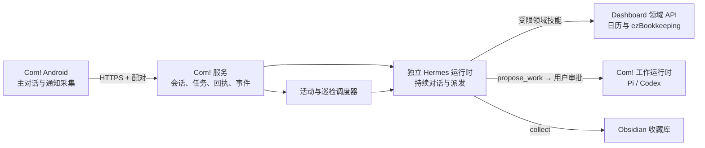

# Com! × Hermes Personal Agent 产品与实施规划

> 规划基线：2026-10-01。用户已确定「Hermes 为持续对话主 Agent，Pi/Codex 为按任务派发的执行 Harness」。此文区分已实施与待实施；当前代码、装机与服务状态以现场复核为准。

## 1. 产品目标

Com! 应成为手机上的**个人 Agent 入口**：默认打开与 Hermes 的一条持续对话。用户随时说话或打字，Hermes 能结合日历、账本、收藏和正在进行的工作回答；简单且有成熟技能的事务由 Hermes 执行，编程任务按需求交给 Pi 或 Codex。用户不需要先选 Harness，也不需要每次新建会话。

产品目标需要走通六个闭环；各项实施状态见第 7 节：

1. 「今天有什么安排？下午还有空吗？」——回答所选日历范围内的真实日程，标明查询范围和更新时间，可打开相应日程。
2. 「午饭 35 元，餐饮，不报销，记一笔」——账本确实新增记录，回答包含金额、分类、账户、记录编号与撤销入口；信息不足才追问。
3. 「周六下午安排攀岩」——检查所选日历冲突，创建后回查，并能在日历页看到同一事件。
4. 「昨天那个工作做到哪了？」——找到真实 Pi/Codex 会话、进度和待回应项，能继续原会话；打开历史仍保持只读。
5. 「收藏这个链接」——由 Hermes 调用统一收藏技能，返回 Obsidian 笔记路径、分类和可打开的结果；重复提交不创建两份。
6. 「帮我修这个小问题／重构这个项目」——前者可派给 Pi，后者可派给 Codex；主对话返回真实工作卡、执行状态和可打开的原会话，完成后回到同一 Hermes 对话。

「随时唤起」的首版含 App 内入口、系统助手快捷语音卡与可选快捷设置磁贴。先验收普通 App 内的对话和录音，再把系统长按入口默认指向 Personal Agent。语音不是唯一入口，文字、搜索和卡片都应可用。

## 2. 动工前基线与缺口

下表保留开工时的现场快照，用于说明设计取舍；授权、接口和装机的最新结果见第 7 节。

| 领域 | 已有资产 | 需要补齐 |
|---|---|---|
| Com! | Android 1.3.4 已装在小米折叠屏；Mac mini 会话服务与公网 HTTPS 在线。系统 `assistant` 设置当前指向 Com! 语音 Activity。已有 Pi/Codex 真会话、历史、审批、终端、配对和 Pi 快捷语音。见 [当前状态](app-overview.md)。 | 目前是工作会话入口；没有固定的个人助理主线、日历/账本接口或统一事务回执。快捷语音固定送 Pi，系统长按手势仍需实物验收。 |
| 日历 | 随行 io 2.4.0 已装机，手机端当前可见 6 个同步的 Google 日历并优先写「Pi」日历；Mac mini 的 Pi Dashboard 有日历查询和写入 API。 | 手机和 Mac mini 所见范围不同：后者只查一个日历、未来 14 天，冲突判断也只覆盖它。2026-10-01 实测 mini 的 Google OAuth 凭据已失效，暂不能读取远端日历；现有手机操作直接写 Android CalendarProvider，尚未接入统一回执。 |
| 账本 | NAS ezBookkeeping 是现行账本；Pi Dashboard 有鉴权查询、写入、撤销和幂等机制；随行 io 有账本页面。 | 当前月汇总不可信：Dashboard 的日期过滤查询在 NAS 上返回截断结果，历史时间戳又混用秒/毫秒。2026-10-01 只读对照中，2026-09 带参查询得到 5 笔，全量读取后按月筛选为 112 笔。见 [汇总代码](../../yeban-union-alpha/backend/dashboard/integrations.py)。 |
| 「任务」 | Com! 的工作中和会话列表是 Agent 执行任务；Pi Dashboard 另有执行队列。 | 这两者都不是统一的个人待办。首版把它们明确标作「工作」，不把执行队列伪装成待办清单；独立待办源另行定义。 |

上表中的「凭据失效」「汇总不可信」是开工时的问题，已修复部分见实施记录。跨两个 Google 账户的日历范围、完整真机读写和云端同步仍需验收。

## 3. 产品结构

### 一条主对话，多种可查看结果

- **默认打开 Hermes 主对话**：同一条可恢复的时间线，底部固定文字／语音输入。发起新请求不创建新会话；离开、杀进程或换网络后重新打开仍能接上。顶部显示 Hermes 当前状态、待回应数和活动入口。
- **「今天」是确定性原生页**：日程、ezBookkeeping 概览、待处理通知与在途工作直接读取 Com! 数据接口和本机缓存，不依赖 Hermes 在线；离线标出缓存时间。主线仍是默认页，底部导航提供主线、今天、活动／工作等清晰入口。
- **对话内呈现结果卡**：日历给事件、范围和更新时间；账本给分币种汇总及交易回执；收藏给 Obsidian 笔记路径；派发给 Pi/Codex 的工作给执行者、进度、结果和「打开工作会话」。可继续用「改刚才那笔」等指代。
- **流式回复与真实进度**：Hermes 的逐段输出在原气泡内展开；Com! 持久化部分文字，断线重连可继续显示已收到内容。状态只由服务端实际事件驱动：已接收、Hermes 开始思考、工具开始执行、正在回复、已完成或结果待核实。
- **底部导航（1.4.1）**：手机与折叠屏展开均使用「对话、今天、活动、工作、更多」，不再使用侧边功能栏。日历、账本和设置从「更多」底部弹层进入，工作历史也从底部展开。「工作」保留原 Pi/Codex 会话、历史、终端和审批。
- **旁支对话按需开启**：较长的项目可以单独放在 side chat；Hermes 主对话仍是默认对象。旁支不会悄悄混入主线的即时上下文，相关结论可以由 Hermes 摘要回主线。
- **语音目标明确**：主对话录音发 Hermes；进入指定 Pi/Codex 工作会话时录音卡标出执行者。旧 Pi 快捷语音在新路由真实验收前保持原目标并清楚标识。

这沿用 [Muse 官方设计说明](https://introducing.muse.ai/) 中的主聊天、旁支、活动、目标和结构化审批原则，以及 [Dots 官方介绍](https://chatgpt.com/features/dots/) 中的持续推进、状态查看与反馈能力；视觉只借鉴信息层级，不复制品牌或装饰。
用户给出的页面参考采用可滚动的 Hermes 身份／状态区、留白的持续聊天、固定圆角输入栏和轻量底部导航；参考图中的 Gmail、订阅取消等仅为示例内容，不进入 Com! 数据。

### 派发规则

| 用户意图 | 默认执行者 | 主对话必须返回 |
|---|---|---|
| 问答、整理、收藏、完整信息的单笔记账 | Hermes + 受限领域技能 | 来源／目标、执行结果、外部 ID、撤销或打开入口 |
| 小范围编程、单文件修复、脚本 | Pi 工作 Harness | 新建或续接的工作 ID、状态、变更与验证结果 |
| 跨模块工程、复杂调试、设计与实现、多阶段交付 | Codex 工作 Harness | 工作 ID、里程碑、待决定项、变更与验证结果 |
| 日历查询、冲突检查、事件创建 | Hermes + 统一日历工具 | 覆盖日历范围、时区、事件 ID 与回查结果 |

派发综合任务范围、所需工具、权限和失败代价；不只靠模型猜「难不难」。用户可以在工作卡上改派或直接进入原 Harness。后台任务与 Hermes 主线解耦，主对话可以继续接收下一句话；派发、失败、取消和完成都进入活动记录。

### 一次操作的反馈

界面显示**已接收、Hermes 正在思考、正在执行工具、正在回复、需要补充、已完成且已回查、结果待核实**。服务超时后不得猜测成功或自动重复写入；通过稳定 `request_id` 查询回执。对日历和账本写入保留外部 ID、版本与撤销入口。读数据的回答带范围和时间，例如「以下只覆盖已选的 3 个日历，更新于 14:20」。

## 4. 技术路线与数据真源

以下为目标架构；实线关系不表示对应的领域写入已经开放。

1. **继续用 Com! Android 作唯一手机入口**，保留包名、配对、会话和缓存；从随行 io 迁移交互与领域能力，不直接拼接两个 APK，也不为同一账本建立第二套数据库。
   主线 Agent 通过稳定 Com! 工具契约读写状态，因此以后可以评估 Pi 等替代大脑，换模型或 Harness 不迁移日历、账本与任务真源。Pi 主线需要另做无编码工具的独立运行时和上下文管理；本期按已确认的 Hermes 主线推进。
2. **Com! 服务做手机的统一入口**。它暴露个人概览与主对话，后续再补日历、账本写入和操作回执；服务端经受控、认证的本机调用接 Pi Dashboard。Android 不再同时持有两套服务凭据。领域服务仍拥有日历和账本的写入规则。Dashboard 已实施 `kind=service` 只读白名单：首个专用凭据只允许日历／财务 GET。服务间凭据仅留在 Mac mini 的受限文件，调用只走回环地址。
3. **恢复真正的 Hermes，独立服务运行**。2026-10-01 现场确认：mini 的旧 Nous Hermes v0.20.0 仍在磁盘，但当前运行的 8642 是 `ai.pi.gateway`，它曾替代 Hermes。Com! 应连接独立的 Hermes 服务／profile 和独立持久会话，不重启旧微信 Hermes gateway，不抢同一 bot token，也不把 Pi 网关冒充 Hermes。先在隔离配置下验证模型、会话、技能和流式接口；具体传输采用本机 Hermes 已有的官方服务协议，Com! 手机只连接 Com! 的 HTTPS 入口。
4. **主对话与执行任务分开保存**。Com! 保存稳定主对话 ID、消息、运行状态、`request_id` 与活动记录；Hermes 原生会话负责模型上下文，长对话按需压缩并检索历史，不把一生的消息原样塞进每轮提示。Pi/Codex 任务有自己的原生工作会话和 `work_id`，结果与状态回投主对话；手机可随时打开原会话、停止或补充要求。
5. **派发通过受限工具而不是自由 shell 拼命令**。Hermes 现有的 `propose_work` 只能提交允许的 agent、工作目录、沙箱、理由和任务文本，返回待审批建议卡；用户在 Com! 批准后才由现有工作运行时启动 Pi/Codex。目标是小范围代码交给 Pi、跨模块复杂工作交给 Codex；实际自动判定与真实工作闭环尚待验收。不能把手机配对密钥或 Codex 认证交给 Hermes。旧 Dashboard `dashboard-` Pi lane 未命中工具白名单的风险必须在后续接入前修正或绕开。
6. **日历以选中的 Google 日历集合作为云端真源**。手机当前看板可见的 6 个 Google 日历分属两个账户；mini 只配置了其中的「Pi」日历。恢复授权后列出可访问日历，再决定另一个账户通过共享还是第二个 OAuth 连接纳入，用户可选择 Agent 可读范围和默认写入日历。手机 CalendarProvider 可保留为本机浏览/离线镜像，但 Agent 的「空闲」判断必须覆盖同一集合。旧 Pi 网关 `calendar_event` 默认写 macOS iCloud，不能拿它充当此契约。
7. **ezBookkeeping 是唯一财务真源**。Hermes 的记账技能应调用 Dashboard 的结构化领域接口，并使用幂等键和回查；旧工具虽也连接同一 NAS，但直连写入缺少 Com! 操作回执。汇总用同一个 `FinanceSnapshot`：币种、期间、交易数、覆盖范围、更新时间和过期状态。
8. **收藏以现有 Obsidian 收藏库为真源**。沿用已验证的 `collect` 规则与目录，统一给 Hermes 可用的技能入口；记录源链接、笔记路径和去重键。旧 Hermes `reference-media-collection` 是废弃桩，不作为可用技能显示。
9. **个人记忆可查看、可修改**。保存明确偏好、任务状态、通知形成的可解释摘要和会话指代；原始通知与账本流水按需读取，不整体放入提示词。用户能查看来源、关闭采集、删除保留的记录。
10. **手机信号以事件驱动采集、定时巡检**。Com! 使用 Android 通知监听服务接收用户授权范围内的新通知，在本机去重、标记来源与时间、过滤验证码等敏感内容，再加密排队上传到 Com! 服务。隔离的 Hermes 通知分析 profile 读取经筛选的通知标题和预览，生成可回查的摘要与草稿；目前它并未自动检查日历、账本或工作变化。将来再把这些来源纳入定时巡检，并提供巡检间隔设置。当前服务端为入库通知即时触发分析、每 30 分钟补查，Android 的周期补传最短 15 分钟且会受省电策略延迟，不能承诺精确时刻。无法从通知预览读出的微信／短信正文应显示“内容不可见”，不能推测。短信全库、应用使用情况、无障碍和 root 等能力分别评估并逐项启用。

### 手机权限阶梯与巡检

| 能力 | 当前状态／首版办法 | 能力边界 |
|---|---|---|
| Com! 自己发通知、录音 | 真机已授权；沿用现有快捷语音和状态通知 | 不等于能读取别的应用通知 |
| 微信、短信等应用通知 | 新增 NotificationListenerService；由用户在系统特殊访问页开启，App 内可选来源、联系人和静默时段 | 只看到系统交给监听器的通知，微信隐藏预览、撤掉的历史和 Android 脱敏内容不可补读 |
| App 使用情况 | 后续单独请求 Usage Access，用于「今天哪些 App 使用多久」 | 只有使用时长／前台状态，没有聊天正文 |
| 短信全库、无障碍、系统级权限 | 首版不隐式开启；若指定自动回复场景确实需要，再逐项设计与真机验证 | READ_SMS 是受限权限；无障碍和 root 也不保证能读到所有微信内容 |

手机通知到达时先本地入队并尝试上传；每 15 分钟做一次补传。Mac mini 每 30 分钟补查已入库但未分析的通知，新事件会即时唤醒分析；间隔选择、重要联系人规则、睡眠时段摘要，以及日历、账本和工作状态的主动巡检仍是后续能力。活动页应如实显示最近监听、上传和巡检时间及延迟。真机曾处于 Rare 待机档，需在目标 HyperOS 上验证后台可靠性。

权限按动作区分只读、可撤销写入和高影响操作。普通单笔信息完整时直接执行并给撤销；缺金额、账户、日期或目标时追问。删除、多笔批量修改、付款和规则外对外发送保留明确的人为决定。凭据留在 Mac mini／Android 安全存储，不进入模型上下文或日志。通知访问需要手机系统设置里的手动授权；Com! 显示已开启的来源、最近接收时间和关闭入口。

用户已选择允许**对其指定的联系人或场景自动回复或操作**。因此建立逐条规则：渠道、精确联系人／群、触发条件、允许动作、内容边界、有效时段、失效日期与每日上限。规则以外的外发仍走审批；规则内每次执行也保存原通知、规则版本、拟执行内容、实际外部回执和撤销可能性。首版在没有具体联系人／场景规则前只自动归纳、建记录和提出建议，不自行给任何人发消息。通知内容中的指令只是待分析数据，不能覆盖用户配置的规则。
用户进一步确认首条场景采取**自动记录，并由 Hermes 起草建议回复，暂不自动发送**。通知巡检只生成可审阅的摘要、待记录建议和草稿；是否采纳、发送或写入其它真源仍由后续明确规则控制。
自动回复还须验明目标：优先使用通知提供的稳定 conversation/shortcut ID 和正式的 Reply action／RemoteInput；只拿到一个显示名、群摘要或不可验证的收件人时停在待确认卡，不发送。微信是否暴露可用的回复 action，要用真实到达的通知在目标手机上验，不能按 Android 通用能力推断微信一定支持。

## 5. 实施顺序与验收

| 阶段 | 交付 | 必须通过的验收 |
|---|---|---|
| 0. 独立 Hermes 与真源 | 在 mini 隔离启动旧 Hermes API，只开放本机端口；修复财务汇总与只读服务凭据；恢复 Google OAuth；核对收藏库和权限。 | 真正 Hermes 两轮连续对话、重连读历史；Pi gateway/微信不中断；财务与 NAS 对账；所选 Google 日历可读；只读凭据写入返回 403。 |
| 1. 单主对话 | Com! 后端建立持久主会话、运行回执与活动记录；Android 冷启动进入 Hermes 聊天，概览成为对话中的带来源卡片；原工作页可到达。 | 关闭重开仍是同一时间线；两轮指代连续；断网保留草稿；进程重启后运行结果可查询，重复请求不重复提交。 |
| 2. 领域技能和派发 | Hermes 经受限工具读写日历／账本、调用收藏；按任务创建 Pi/Codex 工作并回投状态。 | 记账、收藏、日程均有外部 ID 与回查；Pi/Codex 各完成一个真实工作并从主聊天进入；失败与取消状态准确。 |
| 3. 手机信号与巡检 | 通知监听、权限页、加密离线队列、去重上传；事件驱动的重要通知判断与可调周期巡检；活动记录可审计。 | 在真实微信／短信通知到达时核对可见字段，手机重启／断网后恢复；重复通知只记录一次；关闭权限后停止采集；巡检延迟和不可见内容明确展示。 |
| 4. 随时唤起与主动能力 | 主对话语音、系统助手入口、快捷设置磁贴、今日简报、静默时段与通知频率。 | 普通 App、系统入口、内外屏、锁屏/解锁和网络切换跑通；主动消息只针对有意义的新变化；高影响操作仍有审批回执。 |

Android 的麦克风后台启动受系统限制，快捷入口应打开可见的语音 Activity 后开始录音，不能假设后台服务随时能录音。通知监听需要系统授权，部分敏感内容会被 Android 隐去；周期工作最短 15 分钟且会延迟。参考 [Android 通知监听](https://developer.android.com/reference/android/service/notification/NotificationListenerService)、[Android 15 敏感通知规则](https://developer.android.com/about/versions/15/behavior-changes-all)、[周期工作](https://developer.android.com/reference/androidx/work/PeriodicWorkRequest)、[后台麦克风限制](https://developer.android.com/develop/background-work/services/fgs/restrictions-bg-start)。

## 6. 首个可执行切片

首个纵切是**独立 Hermes 两轮对话 → Com! 固定主会话与流式回复 → 真机聊天**，同时提供真实的财务、日历概览和「今天」页。前两段与数据接口已经在线验过；最新 Android 包仍待重新安装与实机走查。接下来完成结构化记账、收藏和日历写入，以及真正由用户批准的 Pi/Codex 派发；通知链路需取得系统授权并用真实微信／短信通知验收。不能用代码编译或模拟通知替代正常使用验收。

默认产品决策：Com! 成为主入口；旧 Hermes 的独立实例是默认对话对象；Pi/Codex 保留在工作区并可被 Hermes 派发；默认写入 Google「Pi」日历；账本沿用 ezBookkeeping；收藏沿用 Obsidian 收藏库。个人待办的真源尚未确认，首版先把巡检发现记入 Com! 活动／候办，不伪装成其它任务系统。旧 Hermes 不接管现役微信机器人。

## 7. 2026-10-01 实施记录

| 范围 | 已实现、已核验 | 尚待完成或验证 |
|---|---|---|
| 账本与概览 | NAS ezBookkeeping 仍是唯一账本。Dashboard 财务汇总改为全量获取后按上海时间筛选，兼容秒／毫秒时间戳；本月与上月数据已和 NAS 独立只读结果对照。`kind=service` 凭据只放在 Mac mini，在线财务 GET 为 200、交易 POST 为 403。Com! `/personal/overview` 在本机和公网 HTTPS 均返回真实财务概览，匿名请求为 401。 | Agent 的单笔记账、撤销和回查尚未接入；「今天」的财务卡仅是只读概览。 |
| Google 日历 | 用户已完成 Mac mini 的 Google OAuth 重授权。本机 Dashboard 日历接口、Com! 本机与公网概览均返回 200，`calendar.available=true`。当前只覆盖已配置的「Pi」日历和未来 14 天；本次查询范围内为 0 条日程。 | 其他账户／日历尚未纳入，因此不能据此判断用户完整空闲时间；Agent 的事件创建、修改及冲突回查尚未验收。 |
| Hermes 主线 | Nous Hermes v0.20.0 以独立 `com-personal` profile 在 Mac mini 回环 `127.0.0.1:8649` 运行，现役 Pi gateway `8642` 和微信机器人未被接管。`com-personal-main` 两轮连续指代及 Com! 重启后历史读取已验证。Hermes 仅有 4 个受限 MCP 工具：读个人概览、读最近工作会话、提出工作建议、查询建议状态；无终端和文件编辑工具。 | 账本／日历写入、收藏、可解释长期记忆与旁支对话尚未接入。 |
| 流式与状态 | Com! 把 Hermes 原生流转成持久消息修订，`/personal/conversation/stream` 用 SSE 发送快照和增量，断线可重取快照。本机与公网真实对话分别观察到 26／18 次增量，含部分回复及服务端阶段；Android 端已经实现 SSE 合并和阶段显示。服务端异常时保留「结果待核实」，不自动重发。 | Android 最新包尚未完成重新安装，逐字展开、前后台切换与断网重连仍需在手机上验收。状态只代表服务端实际事件；不能把「已读」解释成模型理解了用户意图。 |
| 派发 | Hermes 可以提交 Pi/Codex 工作建议卡，Com! 保存幂等标识、执行者、目录、沙箱、审批与状态，并提供用户批准／拒绝接口。实测过一次无害 Codex 只读建议的创建、查询、拒绝和清理，未派发真实工作。 | Pi 现有工作运行时仍是最高权限；在受限运行时上线前，Pi 建议必须显式批准。Pi/Codex 各完成一项真实工作并回投结果的闭环尚未验收。 |
| 通知与巡检 | Android 代码已有用户自选来源的通知监听设置、敏感通知本机跳过、加密离线队列、即时和 15 分钟补传；Com! 收件箱按事件 ID 去重并保留 30 天。隔离的 `com-triage` Hermes profile 在 `127.0.0.1:8651` 无工具，只把可见通知归纳为重要性、摘要、建议记录和回复草稿；新事件即时触发，服务端每 30 分钟补查。合成通知走通分析与删除 Hermes 会话。 | 手机通知特殊访问尚未授权；真实微信／短信通知、系统省电与重启后补传未验。草稿只供查看，不自动发送，也未写入日历或账本。通知标题／预览在 triage 的会话数据库中会短暂落盘；删除会话和每日清理已配置，但异常中断后的彻底清除仍需验证。 |
| Android 界面与视觉 | 1.4.0 工程已有默认 Hermes 持续对话、「今天」日历／账本只读卡、待我处理、在途工作、活动与审批入口、录音输入和工作区。主导航四枚图标与 Hermes 形象已接入 GPT 生成的同系透明 PNG；没有为这些新图标手绘 SVG。 | 早期 1.4.0 包曾在手机上打开主对话；以上最新改动尚未重新安装和整机验收。旧工作区与部分控件仍沿用 Material Icons，完整图标统一需在最终视觉验收时核对。系统长按快捷语音仍指向 Pi。 |

旧 Pi gateway 的 `dashboard-*` lane 仍存在过宽工具权限的风险；未部署会中断现役收藏流程的临时限制。新的 Hermes 只能通过上表中的受限工具读数据、提交待批准建议，不共享该 lane 的权限。
