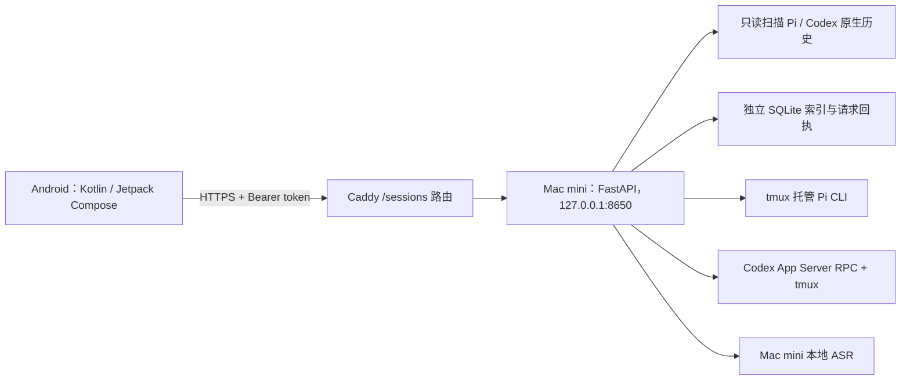

# Com!：项目背景与当前状态

> 截至 2026-10-01，依据本仓库 `main` 分支的 Com! 1.3.4 代码和已记录的验证结果整理。本文供介绍项目与协作使用；“已实现”指代码具备该行为，“已验证”另行标明。

## 可以怎样介绍这款 App

Com! 是一款个人使用的 Android AI 工作入口。用户在手机上选择 Pi 或 Codex、指定 Mac mini 上的工作目录，发起或继续真正运行在 Mac mini 上的任务；离开电脑后，仍能查看回复和执行过程、查找过去的会话、处理需要回应的请求，必要时进入完整终端。它把两个原本分散在命令行和桌面的工作伙伴收进同一个随身界面，同时保留两者各自的原生会话和工具环境。

项目最初叫「会话工作台」，后来以 **Com!** 作为 Android 显示名。包名仍是 `work.eddie.sessions`，因此现有安装可以原位升级并保留手机上的配对与缓存。现在的产品形态是 **Android 客户端 + 用户自建的 Mac mini 服务**；它面向需要在移动场景查看或推动自己电脑上 AI 工作的人，不是面向多人协作的托管服务。

## 背景与要解决的问题

Pi 和 Codex 的工作发生在 Mac mini 的目录、终端与本机会话里。人一旦离开电脑，常见的断点是：不知道哪个任务还在运行或等自己回应，想补一句话却要先回到桌面，过去的成果散落在不同会话文件中，手机上也难以查看真实终端。Com! 因此把 **发现会话、读历史、继续任务、查看过程** 放在同一条路径上。手机承担交互，Mac mini 保持执行环境；切走页面或暂时断网不会因为手机界面关闭就结束远端 tmux 会话。

两位伙伴共用一套会话导航，但保持清楚的身份：Pi 在界面中是流体圆脸，Codex 是蓝色毛绒伙伴；首页可以切换两者。选择并非只改变外观：新会话会使用对应的 Pi CLI 或 Codex App Server，历史和模型目录也按实际 Agent 区分。目前系统快捷语音小窗**固定发送给 Pi**，并不是双伙伴语音入口。

## 用户现在可以走通的主要流程

| 场景 | 当前实现 |
|---|---|
| 打开应用 | 首页切换 Pi / Codex，显示相关会话，并从统一输入区发起任务；“工作中”和全部历史提供其他入口。 |
| 新建工作 | 选择 Agent、Mac mini 用户目录内的工作目录，可直接输入首条消息或打开空会话。Codex 高级设置可选择权限模式；默认是最高权限。 |
| 跟进任务 | 会话页显示消息、归组的工具过程、实时状态和待回应卡片；可发送消息、停止当前执行，或在允许时切换到带 ANSI 色彩的完整终端。 |
| 找回成果 | 索引 Mac mini 已保存的 Pi / Codex 会话；支持全文、Agent、角色、目录、日期筛选以及会话内查找，能置顶、改标题、归档。离线时仅能检索手机已缓存的内容。 |
| 继续历史 | 打开历史默认只读，不会启动 Agent；只有用户明确点击“继续这个会话”，且后端确认可安全接管时才恢复可输入状态。 |
| 选择模型 | 输入框旁的“＋”和新会话高级设置使用同一个原生面板。模型按提供方分组、可搜索，选定后再显示该模型支持的推理档位；设置保存在手机上，下一条消息应用。 |
| 快捷语音 | Android 系统助手入口打开 Pi 小窗。获得麦克风权限后录音；检测到说话后约 0.5 秒静音即提交，最长 60 秒。录音交给 Mac mini 本地 ASR 转写后自动进入 Pi 会话；提交任务由 WorkManager 接续，可在小窗等待回复或上滑进入同一会话。 |

手机端还会显示运行完成、失败和待回应通知。会话详情有显式的“结束远端会话”，会关闭对应终端进程，原始历史仍保留。

## 技术结构与数据流

- **Android**：原生 Compose 负责双伙伴界面、会话与搜索；本地保存已读列表/详情缓存、草稿和模型偏好。终端用只加载应用内资源的 WebView 承载 xterm.js，通过 WebSocket 连接后端，保留终端的层级与 ANSI 颜色。状态轮询与通知、语音的后台送达分别由 Android 组件处理。
- **Mac mini 服务**：FastAPI 提供配对、会话列表与详情、实时状态、模型目录、新建/输入/继续、审批及终端接口。服务通过 launchd 运行在本机回环地址，由 Caddy 的 HTTPS 路由向手机提供访问。会话服务的数据放在 `~/.session-workbench/`，不在 Git 仓库中。
- **历史与执行分开**：历史读取 Pi、Codex 已写入的原生记录，再建立自己的 SQLite 检索索引；读取不会改动原生历史，也不会自动恢复 Agent。Pi 会话通过独立 tmux、事件扩展和受控输入运行；Codex 会话经 App Server 的 `thread/start`、`turn/start` 等接口运行。终端是处理特殊交互的补充入口，不替代正常的结构化会话。
- **模型选择**：Pi 目录来自 Mac mini 的 `pi --list-models`；Codex 目录来自 App Server 的 `model/list`，不是手机内置的固定名单。Codex 在 `turn/start` 传入模型和推理档位；Pi 在会话空闲时先由扩展确认切换成功，再提交用户正文。相同设置的后续消息不会反复切换。
- **语音送达**：手机保留原始 M4A 与稳定的录音标识；后端只做转写，不在转写接口启动 Agent。转写完成后，手机用稳定请求 ID 调用新建或输入接口，并根据服务端回执处理重试，避免重试时重复创建任务。

## 安全与隐私边界

这是一个连接到用户自己 Mac mini 的个人工具。首次配对需在 Mac mini 生成一次性配对码；配对码有效期 10 分钟，成功后手机获取服务令牌。Android 只接受 HTTPS 服务地址，令牌用 Android Keystore 加密保存在手机；后端除健康检查和配对外要求 Bearer 令牌，状态目录和令牌文件限制本机权限。应用禁用 Android 自动备份，历史缓存留在应用私有目录。

**权限需要向使用者讲清楚**：从 Com! 新建的会话默认以最高权限执行。Codex 高级设置另提供“工作目录内写入”和“只读”；Pi 工作台会话使用 `--approve` 并加载仅限此入口的工具扩展。手机经认证后能发送消息、操作审批、进入终端，也就能触发 Mac mini 上的实际工作。工作目录必须存在且位于 Mac mini 用户主目录内，但这不等于把所有操作限制在所选目录。它适合由设备所有者自行配对和使用；当前没有多人账号、角色分权或团队审计系统。

历史索引只覆盖 **Mac mini 上发现且已保存** 的内容，未保存的实时输出无法凭索引补齐。手机离线缓存也是已取回内容的副本，并不代表全量离线历史；清除应用数据会失去本机配对、偏好和缓存。语音先到 Mac mini 的本地 ASR；后续 Pi/Codex 的模型请求仍取决于 Mac mini 上各 Agent 的实际配置与提供方，不能据此宣称整条 AI 处理链完全离线。

## 截至 1.3.4 的交付与验证状态

目前 Android 版本是 **1.3.4（versionCode 8）**。最新改动加入原生模型与推理选择。已记录的检查包括 Android `testDebugUnitTest assembleBenchmark` 通过、后端 15 项测试通过，以及 Mac mini 实际模型接口返回 41 个 Pi 模型、7 个 Codex 模型和 Codex 的真实推理档位。1.3.4 已覆盖安装在小米折叠屏，原应用数据保留；手机上的“＋”面板也已看到 Pi 模型列表。**尚未用所选模型发送新测试消息**，所以不能把 Pi/Codex 模型切换后的真实回复路径写成已完成真机验收。

较早的 1.3.1 验证曾在真机首页发送消息并收到 Pi 的 `OK` 回复，也看到真实快捷语音请求的 accepted 回执；Mac mini 的中文音频转写接口返回过可理解的文字。快捷小窗的 0.5 秒自动发送、窗口内完整回复、上滑进入同一会话，以及折叠屏外屏行为，仍需要按真实使用路径补验。1.3.3 的键盘布局、手势和触感改动通过构建与单测，但当轮没有设备验收；1.3.4 的覆盖安装不等于这些交互已逐项通过。

当前产物是针对现有设备与服务的可安装应用，`benchmark` 构建沿用本机调试签名，尚不是应用商店发布包。Mac mini 部署脚本也以当前主机的 Python、Pi、Codex、tmux、Caddy 路径为前提；移植到其他服务器需要重新核对环境和路由。具体版本证据见 [1.3.1](com-1.3.1.md)、[1.3.2](com-1.3.2.md)、[1.3.3](com-1.3.3.md) 与 [1.3.4](com-1.3.4.md)。早期 [产品方向](COM_PRODUCT_DIRECTION.md) 包含尚未交付的规划，不能用它替代当前实现说明。

## 项目位置

`android/` 是 Android 工程，`backend/` 是 Mac mini 服务及其 Pi 扩展，`backend/tests/` 和 `android/app/src/{test,androidTest}/` 是检查代码。仓库不提交本机虚拟环境、Android 构建产物、连接令牌或 `verification/` 中的设备截图。构建、部署和运行前提见仓库根目录的 [README](../README.md)。
